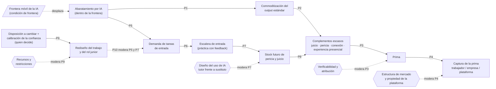
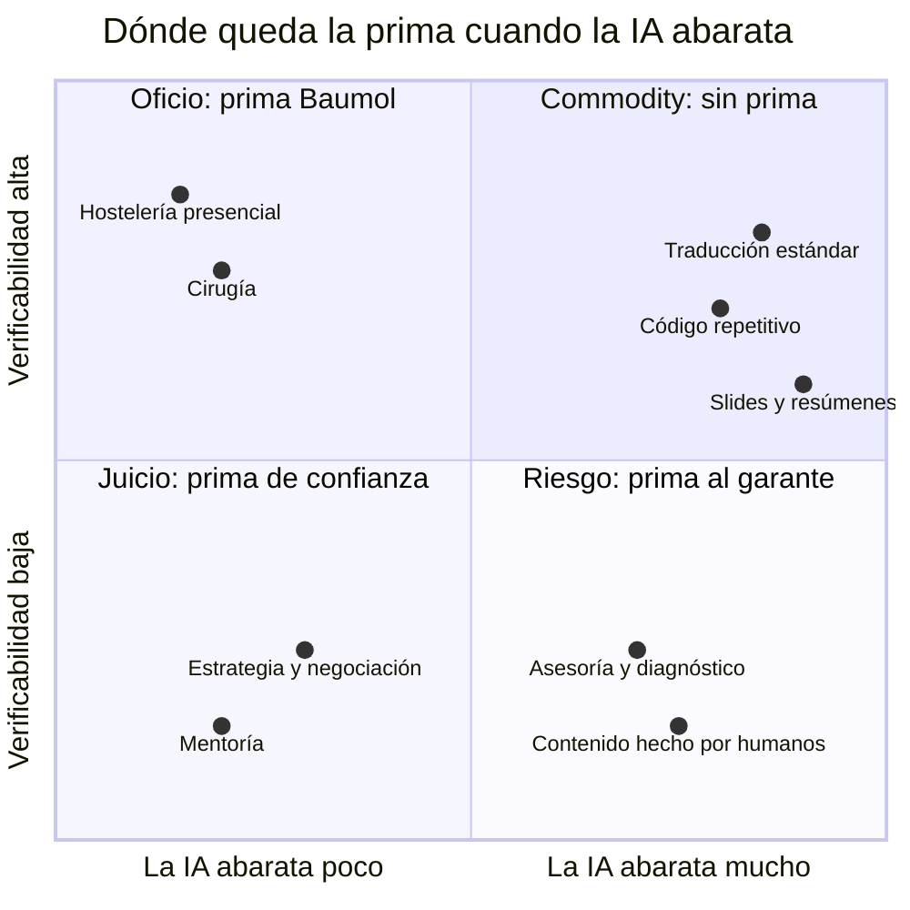
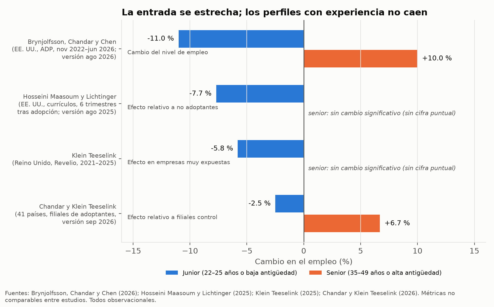
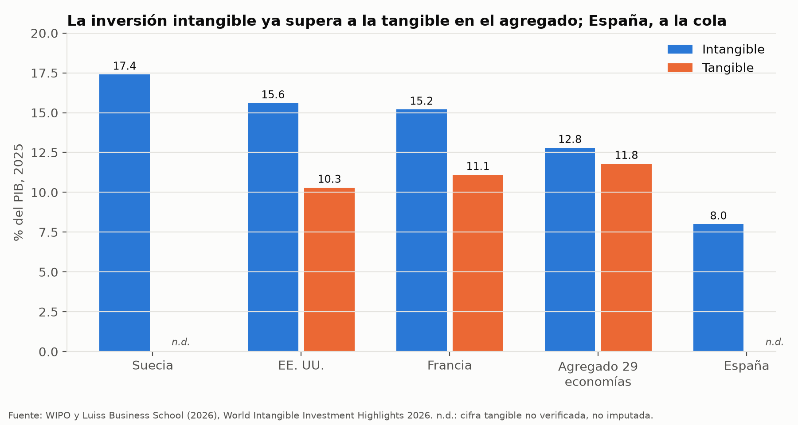
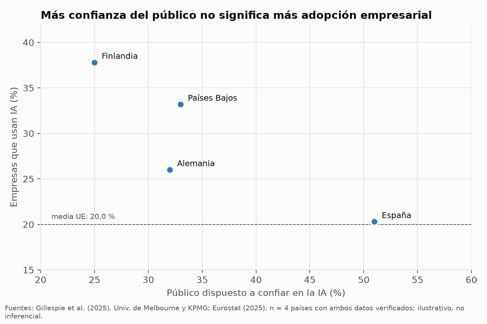

# Qué vale cuando la eficiencia deja de valer: un marco teórico integrado sobre la migración del valor, el juicio y la escalera de entrada en la era de la IA generativa

**Proyecto Value Shift · Documento de trabajo · Versión 1.2 (tres auditorías) · 5 de octubre de 2026**

## 1. Resumen y palabras clave

La inteligencia artificial generativa abarata la producción de output estándar de oficina: textos, análisis, código y presentaciones. Este artículo pregunta qué pasa con el valor humano cuando la eficiencia se vuelve commodity, entendida como valor sin prima. Integramos seis cuerpos de literatura (teoría del valor, tecnología y trabajo, revoluciones tecnológicas, intangibles y experiencia, cognición y juicio, cambio organizacional) mediante una revisión narrativa estructurada con una jerarquía explícita de evidencia y un registro de verificación de cifras. Encontramos cuatro resultados. Primero, la IA reduce el precio del output dentro de su frontera de capacidad, pero los efectos agregados sobre salarios y productividad siguen siendo pequeños. Segundo, la prima no migra a "lo humano" en abstracto, sino a complementos escasos que el cliente puede verificar o atribuir; esta migración no está probada con precios de mercado. Tercero, la contratación de jóvenes en ocupaciones expuestas cae en EE. UU. y el Reino Unido, y la evidencia experimental muestra que delegar sin diseño erosiona el aprendizaje; el daño de largo plazo al pipeline del juicio es plausible, pero no está medido. Cuarto, las creencias de quienes deciden importan dentro de las restricciones de recursos, no por encima de ellas. Proponemos un modelo conceptual con diez proposiciones medibles y una agenda de investigación.

**Palabras clave:** inteligencia artificial generativa; teoría del valor; commoditización; juicio; empleo de entrada; conocimiento tácito; intangibles; adopción tecnológica.

## 2. Introducción

### 2.1 El problema

En una reunión de dirección, alguien propone dejar de contratar juniors porque "la IA ya hace ese trabajo". Nadie quiere hablar del impacto. La escena procede del testimonio del autor y, por sí sola, no es evidencia. Lo que la convierte en pregunta de investigación es que no es aislada. En abril de 2025, Shopify condicionó toda nueva contratación a demostrar que la IA no podía hacer el trabajo (Fortune, 2025). Ese mismo mes, Duolingo se declaró "AI-first" [🔎 prensa; falta el post original de LinkedIn]. Las grandes firmas de auditoría británicas redujeron su entrada de graduados entre 2023 y 2024 [Hecho reportado · Media; prensa con datos de firmas de búsqueda]. Y los datos de nóminas de EE. UU. muestran que el empleo de los trabajadores de 22 a 25 años en las ocupaciones más expuestas a la IA está un 19 % por debajo del de sus pares menos expuestos (Brynjolfsson, Chandar y Chen, revisión de agosto de 2026) [Hecho descriptivo · Media-alta].

Detrás de la escena hay una pregunta más vieja que la IA: qué es el valor y quién lo captura cuando producir algo se vuelve casi gratis. Smith (1776/2009, libro I, cap. IV) observó que nada es más útil que el agua y casi nada se obtiene a cambio de ella. Los marginalistas resolvieron la paradoja: el precio lo fija la escasez de la última unidad, no la utilidad total. Si la IA multiplica la cantidad de análisis, código y prosa disponibles, su utilidad total puede crecer mientras su precio marginal cae. Ese es el sentido de "commodity" que usa este artículo: **valor sin prima, no sin valor**.

### 2.2 Pregunta madre y preguntas derivadas

**Pregunta madre.** ¿Qué pasa con el valor humano cuando la IA convierte la eficiencia en commodity?

De ella derivan cinco preguntas, que corresponden a las partes del libro: qué valorábamos y por qué funcionó (P1); qué se vuelve commodity y a qué velocidad (P2); hacia dónde migra el valor (P3); quién lo captura y quién queda fuera (P4); y qué riesgos y límites tiene el cambio (P5).

### 2.3 Aporte

El proyecto partía de cuatro hipótesis (H1–H4) y seis revisiones de literatura independientes. Este artículo hace tres cosas que esas revisiones no hacían por separado.

1. **Audita la evidencia.** Resuelve diez cifras que diferían entre pilares volviendo a la versión de cada paper (Anexo B). Varias diferencias eran versiones distintas del mismo estudio; dos eran errores (§3.8).
2. **Integra y reformula.** Define cada constructo una sola vez, separa los que se solapaban (juicio, conocimiento tácito, pericia, experiencia de cliente, conexión, tailoring) y reformula las cuatro hipótesis con la evidencia a favor y en contra.
3. **Propone un modelo medible.** Construye un modelo conceptual con mediadores, moderadores y condiciones de frontera, y traduce cada flecha en una proposición con su indicador y su fuente de datos.

La postura del artículo es **optimista con condiciones**. No es una predicción. Es un punto de vista argumentado: la IA puede ampliar lo que las personas hacen bien, pero solo si las organizaciones rediseñan el trabajo de entrada, si los clientes pueden verificar lo que pagan y si las instituciones reparten los costes de la transición. Donde la evidencia no sostiene una hipótesis, lo decimos.

## 3. Método

### 3.1 Diseño

Realizamos una **revisión narrativa estructurada** en cinco fases encadenadas, cada una a cargo de un rol distinto: (1) auditoría de las afirmaciones de los siete documentos de partida; (2) expansión con fuentes nuevas; (3) crítica adversarial de cada hipótesis; (4) síntesis teórica; y (5) redacción. No es una revisión sistemática: no buscamos exhaustividad en bases bibliográficas ni calculamos efectos agregados. Sí aplicamos criterios explícitos de inclusión, una jerarquía de evidencia y un registro de verificación de cada cifra.

### 3.2 Corpus de partida

El corpus inicial lo forman el marco de investigación del proyecto (v0.1) y seis revisiones de literatura fechadas en septiembre de 2026: pilar A (teoría del valor), B (tecnología y trabajo, centrado en el empleo de entrada), C (revoluciones tecnológicas), D (experiencia e intangibles), E (cognición y juicio) y F (cambio organizacional y cultural). La Fase 1 extrajo 60 afirmaciones centrales a un registro con su tipo, confianza, pilar, hipótesis y sentido (archivo `01_auditoria.md`).

### 3.3 Jerarquía de evidencia

| Nivel | Tipo de fuente | Uso en el artículo |
|---|---|---|
| 1 | Revisado por pares y datos oficiales (OCDE, Eurostat, BCE, BLS, Census) | Prueba |
| 2 | Working papers de centros con revisión interna (NBER, Stanford, HBS, BFI) | Prueba provisional; se cita la versión |
| 3 | Libros de referencia | Marco conceptual; no sostienen cifras sin página |
| 4 | Consultoras (McKinsey, BCG, PwC, KPMG, Ocean Tomo, Ipsos) | Señal, nunca prueba |
| 5 | Prensa de calidad | Señal; hechos corporativos atribuidos |
| 6 | Testimonio propio | Ilustración anonimizada |

Una excepción: la encuesta de Gillespie et al. (2025) la financia KPMG pero la diseña y controla la Universidad de Melbourne con muestras representativas; la tratamos como nivel 2.

### 3.4 Criterios de inclusión y exclusión

**Incluimos** fuentes que (a) aportan una cifra con unidad, periodo y país, o un argumento teórico central para una hipótesis; (b) declaran su diseño; y (c) pudimos localizar en su página primaria. **Excluimos** como soporte: estudios retractados o desautorizados (Toner-Rodgers, 2024, desautorizado por el MIT), proyecciones de consultoras, encuestas de preferencias con muestras no probabilísticas, ensayos sin datos usados como datos y anécdotas sin contraste (Anexo C).

### 3.5 Etiquetas

Cada afirmación central lleva tipo y confianza: **[Hecho]**, **[Inferencia]** o **[Especulación]**; confianza **Alta**, **Media** o **Baja**. Nombramos el diseño de cada estudio y distinguimos correlación de causalidad. Cada afirmación central se apoya en dos fuentes independientes; cuando solo hay una, lo indicamos.

### 3.6 Verificación y su límite

La red de la sesión bloqueó la apertura directa de casi todos los repositorios académicos. Verificamos en tres rondas y usamos cuatro estados (Anexo B): **✅** fuente primaria abierta y leída (dos documentos de anthropic.com y la cronología de Hugging Face); **✅\*** cifra confirmada en un extracto de la página primaria devuelto por un buscador; **🔎** solo prensa, solo los pilares o un extracto insuficiente; **❌** cifra contradicha. El estado ✅\* es más débil que la lectura completa; los puntos que siguen abiertos figuran al final del documento.

### 3.7 Límites del método

Tres límites condicionan las conclusiones. Primero, la mayoría de la evidencia sobre empleo junior es observacional y de EE. UU. y Reino Unido; los autores la presentan como "indicadores tempranos", no como estimaciones causales. Segundo, la literatura avanza por versiones de working papers: citamos siempre la versión y el periodo. Tercero, los resultados obtenidos con modelos de 2023–2024 pueden no valer para los de 2026;

### 3.8 Resultado de la auditoría: diez cifras en conflicto

| Cifra en conflicto | Resolución | Estado |
|---|---|---|
| Canaries: 13 %, 16 % o 19 % | Tres versiones: ago 2025 (−13 %), nov 2025 (−16 %), ago 2026 (brecha del 19 %) | ✅\* |
| Brynjolfsson, Li y Raymond: 14 % o 15 %; novatos 34 % o 30 % | NBER 2023: 14 % y 34 %; QJE 2025: 15 % y 30 % | ✅\* |
| Hosseini Maasoum y Lichtinger: 7,7 % o 9 % | 7,7 % (v. 2025); ≈9 % (v. mayo 2026) | ✅\* |
| Shen y Tamkin: 17 % o 17 puntos | 50 % frente a 67 %: 17 puntos (≈25 % relativo) | ✅ |
| Humlum y Vestergaard: 2,8 % o 3 % | 2,8 % de las horas; 3 % es redondeo | ✅\* |
| Bick et al.: 26,5 %, 27 % o 28 % | 28 % (v. 2024); 26,5 % (v. 2025); 27 % redondeo | ✅\* |
| Krueger: 54 % o 56 % | 56 % en 2003; 60 % en 2017; 54 % no localizado | ✅\* / ❌ |
| KPMG Reino Unido: −29 % a −33 % | 1.399 → 942 (2023–2024) = −32,7 %; −29 % es un error | ✅\* / ❌ |
| Chandar y Klein Teeselink: junior −3 % | −2,5 % en el paper | ✅\* |
| Budzyń et al.: "6 puntos" | 28,4 % → 22,4 %: −6 p. p.; −20 % relativo según los autores | ✅\* |

## 4. Marco teórico: seis pilares

Esta sección revisa los seis cuerpos de literatura. Cada pilar sigue la misma estructura: conceptos, escuelas y debates, evidencia, tensión y hueco. La Tabla 1 resume qué autores trabajan qué constructos; la Tabla 2 recoge las definiciones en competencia de los tres términos más disputados; la Figura 1 sitúa la historia en el tiempo.

**Tabla 1.** Matriz de conceptos: autores × constructos (● central; ○ tratado de forma secundaria)

| Autor (año) | Valor y escasez | Commoditización | Juicio | Conocimiento tácito | Pericia | Experiencia de cliente | Conexión | Intangibles | Escalera de entrada | Creencias y adopción |
|---|---|---|---|---|---|---|---|---|---|---|
| Smith (1776) | ● | | | | ○ | | | | | |
| Menger (1871) | ● | ○ | | | | | | | | |
| Polanyi (1966) | | | ○ | ● | ● | | | | | |
| Hirsch (1976) | ● | | | | | | ○ | | | |
| Shapiro y Varian (1998) | ● | ● | | | | | | ○ | | |
| Pine y Gilmore (1998) | ○ | ● | | | | ● | | | | |
| Christensen (1997; 2003) | ○ | ● | | | | | | | | ● |
| Autor, Levy y Murnane (2003) | | ● | ○ | ● | | | | | ○ | |
| Vargo y Lusch (2004) | ● | | | | | ● | ● | | | |
| Haskel y Westlake (2017) | ○ | | | | | | | ● | | |
| Mazzucato (2018) | ● | | | | | | | ○ | | |
| Agrawal, Gans y Goldfarb (2018) | ○ | ● | ● | | | | | | | |
| Acemoglu y Restrepo (2019) | | ● | | | | | | | ○ | |
| Beane (2019; 2024) | | | ○ | ● | ● | | ● | | ● | |
| Kahneman y Klein (2009) | | | ● | ○ | ● | | | | | |
| Tripsas y Gavetti (2000) | | | ○ | | | | | | | ● |
| Deming (2017; 2021) | ○ | | ● | | ● | | ● | | | |
| Brynjolfsson, Li y Raymond (2025) | | ● | | ● | ○ | | | | ● | |
| Vaccaro et al. (2024) | | | ● | | | | | | | ○ |
| Brynjolfsson, Chandar y Chen (2026) | | ○ | | | | | | | ● | |
| Autor y Thompson (2025) | ○ | ○ | | | ● | | | | ● | |
| Gillespie et al. (2025); McElheran et al. (2024) | | | | | | | | | | ● |

**Tabla 2.** Definiciones en competencia de "valor", "commodity" y "juicio"

| Término | Definición | Escuela o autor | Implicación para Value Shift |
|---|---|---|---|
| **Valor** | Valor de cambio determinado por el trabajo incorporado | Clásicos: Smith, Ricardo; Marx | Si el trabajo humano deja de ser necesario, el valor (en sentido marxiano) se contrae y la ganancia depende de apropiarse del trabajo restante. Contradice la idea de que el valor "migra" solo. |
| | Importancia que una persona da a la última unidad disponible | Marginalistas: Menger, Jevons, Walras | La IA aumenta la cantidad y reduce el valor marginal sin reducir la utilidad total. Es la base de "valor sin prima". |
| | Valor cocreado en el uso con el cliente | Vargo y Lusch (2004) | El valor no está en el output sino en la interacción. Apoya lo relacional. |
| | Creación (producir algo nuevo) frente a extracción (apropiarse de lo existente) | Mazzucato (2018) | Quien captura la prima no es necesariamente quien la crea. |
| **Commodity** | Bien homogéneo vendido a precio de mercado, sin prima | Pine y Gilmore (1998); uso del libro | **Definición adoptada**: valor sin prima. |
| | Industria con productos homogéneos, alta sensibilidad al precio, bajos costes de cambio y estabilidad | Reimann, Schilke y Thomas (2010) | Operacionalizable con encuestas a empresas. |
| | Etapa de la cadena modularizada cuya rentabilidad se desplaza a la adyacente | Christensen y Raynor (2003) | Predice hacia dónde migra la prima; heurística sin validación econométrica. |
| **Juicio** | Determinar la recompensa relativa de cada acción y resultado; complemento de la predicción | Agrawal, Gans y Goldfarb (2018) | Si la predicción se abarata, el juicio debería valer más, siempre que no sea demasiado difícil de ejercer (paráfrasis). |
| | Intuición experta fiable en entornos regulares con feedback | Kahneman y Klein (2009) | El juicio humano es fiable justo donde la IA también aprende bien. |
| | Capacidad de decidir en contextos inciertos, mejorada por la experiencia | Deming (2021) | Mide su demanda: 6 % de los empleos en 1960, 34 % en 2018. |
| | Decidir qué importa y responder por ello, con contexto que el modelo no tiene | **Definición adoptada** (§5.1), a partir de Agrawal et al. (2018) y Agarwal et al. (NBER w31422) | Separa juicio de predicción y de conocimiento tácito. |

### 4.1 Pilar A. Teoría del valor: qué pasa con el valor cuando producir cuesta casi nada

**Conceptos.** La distinción entre valor de uso y valor de cambio (Smith, 1776/2009, libro I, cap. IV) y la revolución marginalista (Menger, 1871/2007; Jevons; Walras) separan la utilidad de un bien de su precio. Para los bienes de información, con coste fijo alto y coste marginal casi nulo, la competencia empuja el precio hacia el coste marginal; las empresas sobreviven diferenciando, versionando y agrupando (Shapiro y Varian, 1998). Hirsch (1976) añade los bienes posicionales: los que son escasos en sentido absoluto o social y no se abaratan con la tecnología.

**Escuelas y debates.** Cuatro posiciones se disputan qué pasa cuando el output se abarata. Los marginalistas predicen caída del precio marginal y conservación de la utilidad. La estrategia (Christensen y Raynor, 2003) predice que la rentabilidad reaparece en la etapa adyacente que sigue siendo "no suficientemente buena". La lógica de servicio (Vargo y Lusch, 2004) sitúa el valor en la cocreación. La crítica de Mazzucato (2018) y la literatura marxista reciente sostienen que el valor no migra solo: se redistribuye según el poder sobre la plataforma.

**Evidencia.** El caso mejor medido es la música. Tras Napster, los ingresos por grabaciones cayeron y el precio medio de los conciertos subió un 82 % entre 1996 y 2003, frente a un 17 % del IPC (Krueger, 2005) **[Hecho · Alta]**. La calidad de la música nueva no cayó (Waldfogel, 2017) **[Hecho · Alta]**. Pero la prima se concentró: el 1 % de artistas pasó del 26 % (1982) al 56 % (2003) de los ingresos por conciertos (Connolly y Krueger, 2006) y al 60 % en 2017 (Krueger, 2019) **[Hecho · Alta]**. En trabajo freelance, tras ChatGPT, los profesionales en ocupaciones expuestas perdieron un 2 % de trabajos y un 5,2 % de ingresos mensuales, y los mejores no quedaron protegidos (Hui, Reshef y Zhou, 2024, diferencias en diferencias con datos de Upwork) **[Hecho · Alta]**; Demirci, Hannane y Zhu (2025) replican el patrón con un −21 % de ofertas en escritura y código frente a trabajos manuales **[Hecho · Alta]**. En la demanda, el efecto "hecho a mano" eleva el atractivo de un producto (Fuchs, Schreier y van Osselaer, 2015) y la etiqueta "IA" reduce la valoración del arte (Horton, White e Iyengar, 2023, d = 0,51) **[Hecho · Alta]**. Pero a ciegas, lectores no expertos identifican poemas de IA por debajo del azar (46,6 %) y los valoran mejor (Porter y Machery, 2024), y la publicidad de GPT-4 se percibe de más calidad que la de expertos (Zhang y Gosline, 2023) **[Hecho · Alta]**.

**Tensión.** El valor migra, pero cambia de manos y se concentra. La prima "humana" es una prima de etiqueta y de creencias, no de calidad percibida.

**Hueco.** No hay estudios con precios de transacción que midan una prima duradera por servicios profesionales hechos por humanos frente a IA a igual calidad.

### 4.2 Pilar B. Tecnología y trabajo: qué automatiza la IA, qué crea y qué pasa con la entrada

**Conceptos.** El enfoque de tareas trata un empleo como un paquete de tareas: la tecnología sustituye las rutinarias y complementa las no rutinarias (Autor, Levy y Murnane, 2003). Acemoglu y Restrepo (2019) separan tres efectos: desplazamiento, productividad y reincorporación por tareas nuevas. Autor y Thompson (2025) añaden la **pericia**: el efecto de automatizar depende de si se eliminan las tareas inexpertas o las expertas de una ocupación. Brynjolfsson (2022) advierte de la "trampa de Turing": el incentivo a construir IA que imite y sustituya en vez de aumentar.

**Escuelas y debates.** Cinco escuelas compiten. La de **complementariedad** (Autor, 2015; Acemoglu y Restrepo, 2019) recuerda que cerca del 60 % del empleo de EE. UU. en 2018 estaba en ocupaciones que no existían en 1940 (Autor et al., 2024). La del **reemplazo profesional** (Susskind y Susskind, 2015; Frey y Osborne, 2017) sostiene que las profesiones se descompondrán. La **crítica metodológica** (Arntz, Gregory y Zierahn, 2016) baja el riesgo alto del 47 % al ~9 % al medir tareas dentro de cada ocupación. La **escéptica macro** (Acemoglu, 2025; Humlum y Vestergaard, 2025) no ve efectos agregados. Y la de la **escalera rota** (Brynjolfsson, Chandar y Chen, 2026; Hosseini Maasoum y Lichtinger, 2025; Klein Teeselink, 2025) encuentra que el golpe se concentra en la entrada.

**Evidencia.** En el trabajo, la IA generativa sube más la productividad de los menos expertos: +15 % de media y +30 % en los trabajadores menos expertos en soporte al cliente (Brynjolfsson, Li y Raymond, 2025, despliegue escalonado en una empresa con 5.172 agentes; la versión NBER de 2023 daba +34 % para novatos) **[Hecho · Alta]**; +43 % para consultores por debajo de la media y +17 % para los de arriba (Dell'Acqua et al., 2026, experimento preregistrado con 758 consultores) **[Hecho · Alta]**. En el mercado de trabajo, tres diseños distintos encuentran el mismo patrón por edad o antigüedad (Figura 4):

- Con nóminas de ADP (EE. UU.), el empleo de 22–25 años en los dos quintiles más expuestos cayó un 11 % entre noviembre de 2022 y junio de 2026, mientras el del mismo grupo de edad en los tres quintiles menos expuestos subió un 10 %: una brecha del 19 % (Brynjolfsson, Chandar y Chen, revisión de agosto de 2026) **[Hecho descriptivo · Media-alta; causalidad: Inferencia · Media]**.
- Con 62 millones de currículos y 285.000 empresas, las empresas que adoptan IA generativa reducen el empleo junior un 7,7 % frente a no adoptantes seis trimestres después (≈9 % en la revisión de mayo de 2026), sin cambios en el senior, por menor contratación (Hosseini Maasoum y Lichtinger, 2025, diferencias en diferencias) **[Inferencia causal con supuestos · Media]**.
- En el Reino Unido, las empresas muy expuestas reducen un 5,8 % el empleo junior y las vacantes de ocupaciones expuestas caen un 23,4 % (Klein Teeselink, 2025) **[Inferencia · Media]**; en 41 países, las filiales de adoptantes suben un 6,7 % el empleo senior y bajan un 2,5 % el junior (Chandar y Klein Teeselink, 2026) **[Inferencia · Media]**.

El macro dice "todavía no". En Dinamarca, con encuestas enlazadas a registros administrativos, los efectos en ingresos y horas son nulos y precisos, con un ahorro de tiempo del 2,8 % (Humlum y Vestergaard, 2025) **[Hecho · Alta, corto plazo]**. Acemoglu (2025) estima un tope de 0,66 % de PTF en diez años **[Especulación informada · Media]**. En la zona euro, el empleo juvenil cayó un 18,6 % en TIC y un 5,3 % en servicios profesionales entre el primer trimestre de 2023 y el de 2026, pero el BCE no lo atribuye aún a la IA (BCE, 2026) **[Hecho · Alta; causa abierta]**.

**Tensión.** La IA acelera al junior dentro de la empresa y reduce el incentivo a contratarlo. Autor y Thompson (2025) explican por qué: si se automatizan las tareas inexpertas de una ocupación, suben los salarios de quienes quedan y baja el empleo, porque se encoge el conjunto de personas cualificadas. La escalera rota es un resultado racional para cada empresa y un riesgo colectivo.

**Hueco.** Ningún estudio sigue a una cohorte de juniors no contratados. No existe un equivalente a Canaries con datos administrativos de España.

### 4.3 Pilar C. Revoluciones tecnológicas: velocidad de difusión frente a velocidad institucional

**Conceptos.** Una tecnología de propósito general (GPT) se usa en muchos sectores, mejora con el tiempo y genera complementariedades innovadoras (Bresnahan y Trajtenberg, 1995). La "curva J" explica por qué rinde tarde: primero hay que invertir en intangibles que las cuentas no ven (Brynjolfsson, Rock y Syverson, 2021). La "pausa de Engels" nombra los periodos en que la producción por trabajador crece y los salarios no (Allen, 2009). Perez (2002) describe oleadas de unos 50–60 años con una fase de instalación, una burbuja y una fase de despliegue.

**Escuelas y debates.** Sobre la imprenta, Eisenstein (1979) sostiene que fijó los textos y sostuvo la Reforma y la ciencia; Johns (1998) responde que la fijeza fue una convención social construida durante siglos. Sobre la productividad, los "optimistas del retraso" (David, 1990; Brynjolfsson et al., 2021) esperan rendimientos tardíos; los escépticos del tamaño (Acemoglu, 2025) esperan rendimientos pequeños. Sobre la velocidad, Bick, Blandin y Deming (2025) muestran adopción récord; Narayanan y Kapoor (2025) responden que la IA es una "tecnología normal" cuyo impacto lo marca la velocidad de las instituciones.

**Evidencia.** Las ciudades con imprenta antes de 1500 crecieron un 60 % más que ciudades comparables entre 1500 y 1600 (Dittmar, 2011, variables instrumentales con la distancia a Maguncia) **[Hecho · Alta]**, y tenían al menos 29 puntos más de probabilidad de ser protestantes en 1600 (Rubin, 2014) **[Hecho · Alta]**. La electricidad tardó unas cuatro décadas en dar productividad en las fábricas porque había que rediseñar la planta (David, 1990) **[Inferencia bien fundada · Alta]**. En Gran Bretaña, entre 1780 y 1840 la producción por trabajador creció un 46 % y los salarios reales un 12 % (Allen, 2009), aunque Crafts (2022) sostiene que la pausa fue más corta y menos profunda **[Hecho disputado · Media]**. Para la IA, el 39,6 % de los adultos de EE. UU. de 18 a 64 años la usaba a finales de 2024 y el 26,5 % de los empleados la usaba en el trabajo; la adopción total supera a la del PC y la de internet, pero en el trabajo va al ritmo del PC (Bick et al., 2025, versión revisada) **[Hecho · Alta]**. La adopción empresarial es menor: el 20,0 % de las empresas de la UE con diez o más empleados usaba IA en 2025 (Eurostat, 2025) **[Hecho · Alta]**.

**Tensión.** La IA se difunde a la velocidad del software, pero su efecto económico se rige por la velocidad de las instituciones. Los costes sociales se concentran en la transición y recaen sobre una generación.

**Hueco.** No hay una métrica común para comparar la IA con la electricidad. No sabemos si la curva J de la IA durará cinco o treinta años.

### 4.4 Pilar D. Experiencia e intangibles: por qué lo intangible gana peso

**Conceptos.** La economía de la experiencia describe una progresión de commodities a bienes, servicios y experiencias memorables por las que el cliente paga una prima (Pine y Gilmore, 1998). Los intangibles son inversión sin forma física (software, datos, I+D, diseño, marca, formación, capital organizativo) que escala sin agotarse, es un coste hundido, genera spillovers y produce sinergias (Corrado, Hulten y Sichel, 2009; Haskel y Westlake, 2017). La enfermedad de costes de Baumol predice que los servicios con poco crecimiento de productividad se encarecen en términos relativos (Baumol y Bowen, 1966).

**Escuelas y debates.** La escuela de marketing de la experiencia es un marco de casos; su validación empírica procede sobre todo del turismo. La lógica de servicio discute que el valor se "escenifique": se cocrea. La medición de intangibles (Corrado et al., 2009; EUKLEMS & INTANProd) cambia el diagnóstico del crecimiento. La escuela de Baumol (Nordhaus, 2008; Aghion, Jones y Jones, 2019) aporta la base más sólida para la tesis: si la IA abarata lo automatizable, el peso en el PIB de lo no automatizable sube porque lo esencial y difícil de mejorar se convierte en el cuello de botella.

**Evidencia.** La inversión intangible superó los 10 billones de dólares en 2025 en 29 economías y creció un 3,5 % anual real entre 2008 y 2025, frente al 0,98 % de la tangible; en el agregado supone el 12,8 % del PIB frente al 11,8 % de la tangible (WIPO y Luiss, 2026) **[Hecho · Alta]**. España invierte el 8 % de su PIB en intangibles, la menor intensidad de la UE en la muestra (WIPO y Luiss, 2026; COTEC–Ivie estima un 7,8 %) **[Hecho · Alta, dos fuentes]** (Figura 5). En bolsa, Ocean Tomo (2025) estima que el ~92 % del valor del S&P 500 no se explica por activos tangibles netos **[Señal de consultora; es un residuo que sube con las expectativas]**. Los sectores tecnológicamente estancados de EE. UU. (1948–2001) muestran precios relativos crecientes (Nordhaus, 2008) **[Hecho · Alta]**. En consumo, el metaanálisis de Weingarten y Goodman (2021; 141 estudios) encuentra una ventaja experiencial moderada (d = 0,38), de la que un tercio podría ser sesgo de publicación; se asocia más a la conexión social que a la felicidad y se reduce con bajo nivel socioeconómico **[Hecho · Alta]**. Los jóvenes británicos gastaron en 2017 una proporción menor en experiencias que su cohorte equivalente en 2001, según el análisis de Frontier Economics sobre datos de la ONS **[Hecho · Media; consultora sobre datos oficiales]**. Y la prima de marca se apoya en parte en información imperfecta: los farmacéuticos compran analgésicos de marca el 9 % de las veces frente al 26 % del consumidor medio (Bronnenberg et al., 2015) **[Hecho · Alta]**.

**Tensión.** Baumol dice que lo humano cuesta más, no que valga más para el cliente. Parte de la "migración de valor" es encarecimiento relativo, no prima voluntaria. Y los intangibles que más crecen (software, datos, I+D) son codificables.

**Hueco.** No sabemos separar precio y volumen en la migración hacia servicios, ni si los jóvenes españoles gastan más en experiencias que generaciones anteriores a igual renta (falta explotar la EPF del INE por edad).

### 4.5 Pilar E. Cognición y juicio: cuándo la IA ayuda y cuándo estorba

**Conceptos.** Agrawal, Gans y Goldfarb (2018) separan predicción (estimar lo desconocido) de juicio (decidir cuánto vale cada resultado) y predicen que, al abaratarse la predicción, el juicio vale más. Polanyi (1966) define el conocimiento tácito con una frase célebre: "we can know more than we can tell" (p. 4). Kahneman y Klein (2009) fijan las condiciones de la intuición experta fiable: entorno regular y práctica prolongada con feedback rápido. Parasuraman y Manzey (2010) documentan el sesgo de automatización: seguir al sistema cuando se equivoca.

**Escuelas y debates.** La economía de la complementariedad (Agrawal et al.; Autor, 2015) choca con la evidencia experimental de que la complementariedad no se materializa sola. La escuela de decisión naturalista (Klein) y la de heurísticos y sesgos (Kahneman) acordaron en 2009 un punto de encuentro: la intuición vale en entornos de alta validez. Eso tiene una consecuencia incómoda para el libro: los entornos regulares son también los que mejor aprende una IA. La visión computacional de la mente (Kurzweil, 2012) sostiene que todo lo tácito es, en principio, aprendible; la paradoja de Moravec sigue viva en robótica.

**Evidencia.** El metaanálisis de Vaccaro, Almaatouq y Malone (2024; 106 estudios, 370 efectos) encuentra que, de media, las combinaciones humano-IA rinden peor que el mejor de los dos por separado (g = −0,23; IC 95 %: −0,39 a −0,07); pierden en tareas de decisión, ganan en creación, ganan cuando el humano es mejor que la IA y pierden cuando la IA es mejor **[Hecho · Alta]**. Dar a radiólogos las predicciones de una IA no mejora su rendimiento medio; darles información contextual sí (Agarwal, Moehring, Rajpurkar y Salz, NBER w31422) **[Hecho · Alta]**. Con sugerencias erróneas de una supuesta IA, la precisión en mamografías cayó de casi el 80 % a menos del 20 % en radiólogos inexpertos y del 82 % al 45,5 % en los muy expertos (Dratsch et al., 2023; cifras de la nota de prensa de RSNA) **[Hecho · Alta]**. En consultoría, quienes usaron GPT-4 en una tarea fuera de su frontera acertaron 19 puntos menos (Dell'Acqua et al., 2026) **[Hecho · Alta]**.

El deskilling tiene ya datos. Endoscopistas experimentados que usaron IA de detección durante meses detectaron menos adenomas cuando trabajaron sin ella: del 28,4 % al 22,4 % (Budzyń et al., 2025, observacional multicéntrico) **[Hecho de asociación · Media]**. Estudiantes que practicaron con GPT-4 sin salvaguardas rindieron un 17 % peor al retirarles la herramienta; un tutor que solo daba pistas evitó el daño (Bastani et al., 2025, experimento de campo con casi mil alumnos) **[Hecho · Alta]**. Programadores mayormente junior que aprendían una librería con IA sacaron un 50 % en comprensión frente a un 67 % sin IA; quienes usaron la IA para preguntar conceptos sacaron un 65 % o más (Shen y Tamkin, 2026; Anthropic, 2026, ensayo aleatorizado con 52 participantes) **[Hecho · Media: muestra pequeña, preprint]**. La IA mejora los relatos de los escritores menos creativos pero los hace más parecidos entre sí (Doshi y Hauser, 2024) **[Hecho · Alta]**.

**Tensión.** El juicio humano no gana valor de forma automática. Solo lo gana cuando la persona aporta información o criterio que el modelo no tiene, calibra su confianza en la máquina y conserva la práctica que forma ese criterio. Pero el contraejemplo optimista existe: tras la llegada de la IA sobrehumana, los jugadores profesionales de Go tomaron mejores decisiones y probaron jugadas nuevas (Shin et al., 2023) **[Hecho de asociación · Media]**.

**Hueco.** Nadie ha medido la trayectoria de juicio de una cohorte que aprende con IA durante años, ni la duración y reversibilidad del deskilling.

### 4.6 Pilar F. Cambio organizacional y cultural: por qué unos se adaptan y otros no

**Conceptos.** La destrucción creativa (Schumpeter, 1942) y la innovación disruptiva (Christensen, 1997) explican por qué los líderes caen. La inercia cognitiva (Tripsas y Gavetti, 2000) y la identidad organizacional (Tripsas, 2009) explican por qué no ven el cambio. Las capacidades dinámicas (Teece, Pisano y Shuen, 1997) explican cómo se reconfiguran. En el nivel país, Hofstede (2001) y el World Values Survey describen perfiles de valores.

**Escuelas y debates.** La escuela estructural (Christensen) explica el fracaso por la asignación racional de recursos; King y Baatartogtokh (2015) encuentran que solo el 9 % de sus 77 casos muestra los cuatro rasgos de la teoría. La escuela cognitiva (Tripsas y Gavetti; Helfat y Peteraf, 2015) pone el peso en las creencias directivas. La literatura de "empresas excelentes" (Collins y Porras, 1994; Collins, 2001) no resiste el examen: Rosenzweig (2007) la acusa de efecto halo y muestreo sobre el resultado. La escuela cultural (Gorodnichenko y Roland, 2017) encuentra que solo el individualismo tiene un efecto robusto sobre la innovación; Taras, Steel y Kirkman (2016) muestran que ~80 % de la variación en valores culturales está dentro de los países.

**Evidencia.** Polaroid tenía capacidades digitales punteras y aun así fracasó porque sus directivos seguían pensando con el modelo de "cuchillas y maquinilla" (Tripsas y Gavetti, 2000, estudio de caso longitudinal) **[Hecho dentro del caso · Alta; generalización: Inferencia]**. La adopción de IA depende mucho del tamaño: en EE. UU. (2018), menos del 6 % de las empresas la usaba, pero ~18 % ponderado por empleo (McElheran et al., 2024, encuesta del Census a 850.000 empresas) **[Hecho · Alta]**. En la UE, el uso va del 42,0 % (Dinamarca) al 5,2 % (Rumanía); España está en la media con un 20,3 % (Eurostat, 2025) **[Hecho · Alta]**. La confianza del público va en sentido contrario: el 46 % de las personas de 47 países está dispuesta a confiar en la IA, el 39 % en economías avanzadas frente al 57 % en emergentes (Gillespie et al., 2025) **[Hecho · Alta]**. España (51 %) confía el doble que Finlandia (25 %), y Finlandia adopta casi el doble (37,8 % frente a 20,3 %) (Figura 6). Dentro de las empresas, METR encontró desarrolladores expertos un 19 % más lentos con IA que creían haber ido un 20 % más rápido (Becker et al., 2025, ensayo con 16 desarrolladores y 246 tareas) **[Hecho · Media]**.

**Datos culturales para el capítulo 10.** Según las puntuaciones de Hofstede, España, Colombia, Guatemala y Japón tienen distancia al poder de 57, 67, 95 y 54 y evitación de la incertidumbre de 86, 80, 101 y 92. En individualismo, las puntuaciones originales eran 51, 13, 6 y 46; las vigentes en la herramienta de The Culture Factor (consultadas en mayo de 2025) son 67, 13, 6 y 62: España y Japón subieron y Colombia y Guatemala no cambiaron **[Hecho · Media; ✅\*]**. En el mapa Inglehart–Welzel de 2023, Japón está entre los países más secular-racionales; Colombia y Guatemala, en el grupo latinoamericano de valores tradicionales con autoexpresión moderada; España, en la Europa católica **[🔎: extraer coordenadas del WVS]**.

**Tensión.** Las creencias de los directivos explican bien por qué una empresa concreta con recursos no reacciona. Cuando se comparan países y empresas en masa, mandan los recursos, el tamaño y las instituciones.

**Hueco.** No hay diseños con variación exógena en las creencias directivas, ni un estudio que vincule la confianza del público con la adopción empresarial país a país.

### 4.7 La historia en el tiempo

**Figura 1.** Línea de tiempo: de Smith (1776) a 2026

```mermaid
timeline
    title Del valor-trabajo a la IA generativa
    section Teoría del valor y división del trabajo
        1776 : Smith, La riqueza de las naciones (agua y diamante; fábrica de alfileres)
        1871 : Menger y Jevons, valor subjetivo y marginal
        1911 : Taylor, administración científica
    section Tecnología, profesiones y conocimiento
        1942 : Schumpeter, destrucción creativa
        1966 : Polanyi, la dimensión tácita; Baumol y Bowen, enfermedad de costes
        1976 : Hirsch, bienes posicionales
        1990 : David, la dinamo y el ordenador
        1995 : Bresnahan y Trajtenberg, tecnologías de propósito general
        1997 : Christensen, el dilema del innovador
        1998 : Pine y Gilmore, economía de la experiencia; Shapiro y Varian, Information Rules
    section Tareas, intangibles y predicción
        2003 : Autor, Levy y Murnane, el enfoque de tareas
        2004 : Vargo y Lusch, lógica de servicio
        2009 : Kahneman y Klein, condiciones de la intuición experta
        2012 : Fin de la Britannica impresa; quiebra de Kodak
        2017 : Haskel y Westlake, capitalismo sin capital
        2018 : Agrawal, Gans y Goldfarb, máquinas de predicción
    section IA generativa
        2022 : Lanzamiento de ChatGPT (noviembre)
        2023 : Eloundou et al., exposición de ocupaciones; Dell'Acqua et al., frontera irregular
        2024 : Vaccaro et al., metaanálisis humano-IA; Ley de IA de la UE
        2025 : Canaries (ago); Brynjolfsson, Li y Raymond en QJE; Klarna vuelve a contratar humanos
        2026 : IBM triplica la entrada; Canaries, brecha del 19 % (ago); incidentes de evaluación de OpenAI y Anthropic (jul)
```

*Versión renderizada: `figuras/fig1_linea_tiempo.png`.*

## 5. Síntesis: constructos, modelo conceptual, hipótesis y proposiciones

### 5.1 Constructos: una definición, un nombre

La revisión encontró que el marco usaba seis términos que se solapan. A partir de aquí, cada constructo tiene una sola definición y un solo nombre.

**Tabla 3.** Constructos adoptados

| Constructo | Definición adoptada | No confundir con | Base |
|---|---|---|---|
| **Abaratamiento por IA** | Reducción del coste o del tiempo para producir un output a igual calidad gracias a la IA, dentro de su frontera de capacidad. | Exposición potencial (Eloundou et al.), que mide lo que la IA *podría* hacer. | Dell'Acqua et al. (2026); Eloundou et al. (2024) |
| **Commoditización** | Estado en que un output se vuelve homogéneo, sensible al precio y con precio cercano a su coste marginal: **valor sin prima**. | Pérdida de valor de uso. | Shapiro y Varian (1998); Reimann et al. (2010) |
| **Prima** | Diferencia entre el precio (o salario) pagado y el del sustituto commoditizado más cercano a igual calidad observable. | Coste relativo (Baumol). | Definición propia |
| **Complemento escaso** | Insumo cuya oferta no aumenta con la IA y cuya combinación con el output abaratado aumenta su valor. | "Lo humano" en general. | Christensen y Raynor (2003); Agrawal et al. (2018) |
| **Verificabilidad y atribución** | Capacidad del cliente para comprobar, a coste razonable, la calidad de un output (verificabilidad) y su origen o responsable (atribución). | Calidad. | Supuesto propio, inspirado en la literatura de bienes de confianza y en Porter y Machery (2024) |
| **Juicio** | Acto de decidir qué importa y cuánto vale cada resultado, usando contexto que el modelo no tiene y respondiendo por la decisión. | Predicción; conocimiento tácito. | Agrawal et al. (2018); Agarwal et al. (NBER w31422) |
| **Conocimiento tácito** | Propiedad de un saber que su poseedor no puede articular por completo. Es un insumo, no una capacidad. | Juicio; pericia. | Polanyi (1966); Autor (2015) |
| **Pericia** | Stock de saber y criterio acumulado con práctica, casos y feedback que permite rendir en tareas de alta exigencia. | Experiencia de cliente. | Autor y Thompson (2025); Kahneman y Klein (2009) |
| **Experiencia de cliente** | Oferta escenificada y cocreada que el cliente vive y recuerda. | Pericia del trabajador. | Pine y Gilmore (1998); Vargo y Lusch (2004) |
| **Conexión** | Activo relacional: confianza acumulada entre personas que reduce costes de verificación y permite compartir contexto privado. | Tailoring. | Vargo y Lusch (2004); Weingarten y Goodman (2021) |
| **Tailoring contextual** | Adaptación del output con contexto privado que el cliente comparte por confianza, con un responsable identificable y con cocreación. | Personalización algorítmica (adaptación por datos observados, a escala, sin responsable personal). | Definición propia; contraste con Salvi et al. (2025) |
| **Escalera de entrada** | Flujo de personas que, mediante tareas reales de baja complejidad bajo supervisión, acumulan la práctica que forma pericia y juicio. | Contratación junior (que es un indicador de la escalera, no la escalera). | Lave y Wenger (1991); Beane (2024) |
| **Disposición a cambiar** | Voluntad de quien decide de modificar procesos, roles y modelo de negocio ante una tecnología. | Confianza del público. | Tripsas y Gavetti (2000) |
| **Calibración de la confianza** | Ajuste entre la confianza depositada en la IA (o en uno mismo) y su precisión real. | Disposición a cambiar. | Steyvers et al. (2025); Becker et al. (2025) |
| **Recursos y restricciones** | Tamaño, capital, capital intangible, capacidades técnicas e instituciones que permiten o impiden adoptar y rediseñar. | Cultura nacional. | McElheran et al. (2024); Comin y Hobijn (2010) |
| **Captura** | Parte de la prima que se queda cada actor: trabajador, empresa, plataforma o proveedor del modelo. | Creación de valor. | Mazzucato (2018) |

### 5.2 Hipótesis reformuladas

**H1 (reformulada). Commoditización dentro de la frontera.** La IA reduce el precio y la prima del output estándar *dentro de su frontera de capacidad*, incluida una parte del conocimiento que considerábamos tácito, sin eliminar su valor de uso. El ajuste aparece primero en mercados de precio flexible y en el margen de contratación, no en salarios agregados.

**H2 (reformulada). Migración de la prima a lo escaso y verificable.** La prima migra a los complementos que siguen siendo escasos *y* que el cliente puede verificar o atribuir: juicio con contexto y responsabilidad, pericia, conexión y experiencia presencial. Quién captura esa prima depende de la escasez y de la estructura del mercado (plataforma, marca, regulación), no de que el insumo sea "humano".

**H3 (reformulada). Escalera de entrada en riesgo, salvo rediseño.** Reducir la contratación de entrada sin rediseñar el rol disminuye el flujo de práctica que forma pericia y juicio. El daño depende de cómo se usa la IA en el aprendizaje: como tutor, conserva o acelera la formación; como sustituto, la erosiona.

**H4 (reformulada). Creencias dentro de las restricciones.** Con recursos parecidos, la disposición a cambiar de quienes deciden, *más la calibración de su confianza en la IA*, explica qué organizaciones rediseñan el trabajo y capturan valor. Sin recursos ni instituciones, las creencias no bastan. La hipótesis no se sostiene a nivel país.

### 5.3 Modelo conceptual

**Figura 2.** Modelo conceptual de Value Shift (las etiquetas Pn remiten a las proposiciones de §5.4)

*Versión renderizada: `figuras/fig2_modelo_conceptual.png`.*

**Justificación de cada flecha**

| Flecha | Relación | Justificación | Tipo |
|---|---|---|---|
| P1 | Abaratamiento → commoditización | Teoría marginalista y de bienes de información (Shapiro y Varian, 1998); evidencia en plataformas (Hui et al., 2024; Demirci et al., 2025). | Fuente |
| P2 | Commoditización → valor de complementos escasos | Ley de conservación de beneficios atractivos (Christensen y Raynor, 2003); predicción y juicio como complementos (Agrawal et al., 2018); música (Krueger, 2005). | Fuente (heurística + un caso medido) |
| P3 | Complementos → prima | Primas salariales al juicio y a lo social antes de la IA (Deming, 2017; 2021); primas a habilidades complementarias (Stephany y Teutloff, 2024). | Fuente (indirecta) |
| Moderador de P3 | Verificabilidad y atribución | La prima humana desaparece a ciegas (Porter y Machery, 2024) y depende de la etiqueta (Horton et al., 2023); la etiqueta "humano" no añade valor si es el supuesto por defecto (Lim et al., 2026). | Supuesto propio apoyado en experimentos |
| P4 | Prima → captura | Concentración en el 1 % en música (Connolly y Krueger, 2006); creación frente a extracción (Mazzucato, 2018); márgenes en servicios recurrentes (Apple, 10-K 2025). | Fuente (casos) |
| Moderador de P4 | Estructura de mercado | Shapiro y Varian (1998); Mazzucato (2018). | Fuente (teoría) |
| P5 | Abaratamiento → menor demanda de tareas de entrada | Brynjolfsson, Chandar y Chen (2026); Hosseini Maasoum y Lichtinger (2025); Klein Teeselink (2025); Autor y Thompson (2025). | Fuente (observacional) |
| P6 | Menos tareas de entrada → menos práctica | Participación periférica legítima (Lave y Wenger, 1991); aprendizaje en la sombra (Beane, 2019). | Fuente (cualitativa) |
| P7 | Menos práctica → menos pericia futura | Kahneman y Klein (2009); Bastani et al. (2025); Shen y Tamkin (2026); Budzyń et al. (2025). Ningún estudio mide el efecto a diez años. | Fuente (corto plazo) + **supuesto propio** (largo plazo) |
| Moderador de P7 | Diseño del uso de IA | Tutor con pistas frente a chat estándar (Bastani et al., 2025); preguntas conceptuales frente a delegación (Shen y Tamkin, 2026). | Fuente (experimental) |
| P8 | Pericia futura → oferta de complementos escasos | Deming (2021): la pericia en decisión crece con la experiencia. El lazo de retorno es **supuesto propio**. | Supuesto propio |
| P9 | Creencias + calibración → rediseño | Tripsas y Gavetti (2000); David (1990); METR (Becker et al., 2025). | Fuente (casos + un ECA) |
| Moderador de P9 | Recursos y restricciones | McElheran et al. (2024); Eurostat (2025); Gillespie et al. (2025). | Fuente (oficial) |
| P10 | Rediseño → atenúa P5 y P7 | IBM, según Axios (2026), como anuncio; Bastani et al. (2025) como mecanismo. Sin evaluación de resultados. | **Supuesto propio** con señales |
| Frontera | Frontera móvil | Kurzweil (2012); Brynjolfsson, Li y Raymond (2025); FRI (2026). | Condición de frontera |

**Condiciones de frontera del modelo.** (1) Vale para tareas cognitivas de oficina dentro de la frontera irregular de la IA; no para trabajo físico (paradoja de Moravec). (2) Vale a corto y medio plazo: si la frontera se mueve, cambian los complementos escasos. (3) Vale en mercados donde el cliente puede pagar por verificación o atribución; en mercados de bajo presupuesto, gana el precio. (4) Vale para empresas con recursos para adoptar; para pequeñas empresas y países de renta media, mandan las restricciones.

**Figura 3.** Mapa 2×2: lo que la IA abarata × lo que el cliente puede verificar (posiciones ilustrativas, no medidas)

*Versión renderizada: `figuras/fig3_mapa_2x2.png`.*

**Propuesta de mejora de los ejes.** El eje vertical del marco ("lo que el cliente puede verificar") debe desdoblarse en **verificabilidad de la calidad** y **atribución del origen**. La evidencia lo exige: el contenido "hecho por humanos" puede tener calidad indistinguible a ciegas (baja verificabilidad de calidad) pero conservar valor si su origen se puede atribuir y certificar. En el cuadrante inferior derecho, la prima no desaparece: migra a quien garantiza (marca, firma profesional, certificación, responsabilidad legal). Es la lectura que mejor encaja con Bronnenberg et al. (2015): parte de la prima de marca es pago por información imperfecta, y la IA puede reducirla o, si la confianza se vuelve escasa, aumentarla.

### 5.4 Proposiciones y medición

**Tabla 4.** Operacionalización: constructo → indicador → fuente de datos

| Constructo | Indicador | Fuente de datos |
|---|---|---|
| Abaratamiento por IA | Tiempo por tarea con y sin IA; exposición por ocupación | Experimentos de campo; Eloundou et al. (2024); Anthropic Economic Index |
| Commoditización | Precio por encargo y número de encargos en ocupaciones expuestas; dispersión de precios | Upwork, Fiverr (Hui et al., 2024; Demirci et al., 2025) |
| Prima (juicio) | Retorno salarial a ocupaciones intensivas en decisión antes y después de 2023 | CPS + O\*NET (Deming, 2021); en España, EES del INE + MCVL |
| Prima (humano/atribución) | Precio de transacción de obras con y sin certificación de autoría humana a igual calidad ciega | Marketplaces (CGTrader, Etsy, bancos de imágenes); subastas |
| Verificabilidad y atribución | Coste de detectar un error; existencia de certificación o responsabilidad legal; precisión de identificación a ciegas | Encuestas a clientes; experimentos tipo Porter y Machery (2024) |
| Captura | Margen bruto por segmento; participación del trabajo; comisiones de plataforma | 10-K (SEC); cuentas nacionales; datos de plataforma |
| Escalera de entrada | Altas de 22–25 años por ocupación expuesta; tasas de promoción junior → senior | ADP (EE. UU.); **MCVL** (España); Revelio, LinkedIn |
| Pericia | Rendimiento sin IA tras periodo con IA; medida de expertise por tarea | Pruebas tipo Bastani et al. (2025); Autor y Thompson (2025) |
| Diseño del uso de IA | Tipo de interacción (pregunta conceptual frente a delegación) | Registros de uso; Shen y Tamkin (2026) |
| Disposición a cambiar | Lenguaje directivo sobre IA en llamadas de resultados; encuestas a directivos | Transcripciones; Yotzov et al. (NBER w34836) |
| Calibración | Diferencia entre ganancia percibida y medida; puntuación de Brier | ECA tipo METR (Becker et al., 2025); Steyvers et al. (2025) |
| Recursos y restricciones | Tamaño; inversión intangible/PIB; uso de IA por empresas | Census ABS; WIPO y Luiss (2026); Eurostat (2025) |

**Proposiciones (una por flecha)**

- **P1.** En las tareas dentro de la frontera de la IA, el precio por unidad de output cae tras la adopción. *Medición:* diferencias en diferencias en plataformas freelance entre tareas expuestas y no expuestas.
- **P2.** Cuanto más se commoditiza un output, más aumenta el valor relativo de sus complementos escasos en la misma cadena. *Medición:* cambio en la cuota de ingresos de la etapa complementaria (por ejemplo, revisión, implantación o relación con el cliente) frente a la etapa commoditizada, por sector.
- **P3.** Los complementos escasos generan prima solo en la medida en que el cliente puede verificar su calidad o atribuir su origen. *Medición:* experimento con precio real (no declarado) que manipule la información de autoría y la posibilidad de verificación.
- **P4.** La parte de la prima que captura el trabajador es menor cuanto más concentrada está la plataforma que intermedia. *Medición:* comparación de ingresos de trabajadores con habilidades complementarias entre mercados con distinta concentración.
- **P5.** La adopción de IA reduce la contratación de entrada en ocupaciones donde automatiza tareas inexpertas, más que en las que automatiza tareas expertas. *Medición:* altas por edad y ocupación (MCVL) cruzadas con la medida de Autor y Thompson (2025).
- **P6.** Menos contratación de entrada implica menos horas de práctica supervisada por cohorte. *Medición:* encuestas de uso del tiempo y registros de tareas por antigüedad.
- **P7.** Las cohortes con menos práctica supervisada tienen, a cinco y diez años, menor rendimiento sin IA y menores tasas de promoción. Este efecto es menor cuando la IA se usa como tutor. *Medición:* estudio de cohortes con pruebas de rendimiento sin IA.
- **P8.** El stock de pericia de una organización predice su capacidad de ofrecer complementos escasos con prima. *Medición:* panel de empresas con medidas de pericia y márgenes.
- **P9.** Con recursos parecidos, las empresas cuyos directivos combinan disposición a cambiar y confianza calibrada rediseñan antes el trabajo. *Medición:* panel de empresas emparejadas por tamaño e inversión intangible, con medidas de creencias y de rediseño de puestos.
- **P10.** El rediseño del rol junior (más cliente, verificación y excepciones; IA como tutor) atenúa la caída de la contratación de entrada y la pérdida de pericia. *Medición:* comparación de empresas que rediseñan (anunciado, como IBM) frente a las que congelan, con datos de altas y promoción.

## 6. Evidencia por hipótesis

**Tabla 5.** Hipótesis × evidencia a favor, en contra y confianza

| Hipótesis | A favor (diseño) | En contra (diseño) | Confianza | Veredicto |
|---|---|---|---|---|
| **H1** | Hui et al. (2024; DiD); Demirci et al. (2025; DiD); Brynjolfsson, Li y Raymond (2025; despliegue escalonado); Dell'Acqua et al. (2026; experimento); Eloundou et al. (2024; exposición) | Humlum y Vestergaard (2025; registros); Acemoglu (2024; modelo); Bick et al. (2025; 1–5 % de horas); Yale Budget Lab (descriptivo) | Alta en tareas; Baja en agregado | **Apoyada** (dentro de la frontera y en mercados flexibles) |
| **H2** | Krueger (2005); Deming (2017; 2021); Stephany y Teutloff (2024); Mäkelä y Stephany (2024); Agarwal et al. (NBER); Nordhaus (2008); Fuchs et al. (2015) | Brynjolfsson, Li y Raymond (2025); Vaccaro et al. (2024); Porter y Machery (2024); Zhang y Gosline (2023); Lim et al. (2026); Connolly y Krueger (2006); Weingarten y Goodman (2021) | Media en teoría; Baja en precios | **Matizada; no probada en precios de mercado** |
| **H3** | Brynjolfsson, Chandar y Chen (2026); Hosseini Maasoum y Lichtinger (2025); Klein Teeselink (2025); Chandar y Klein Teeselink (2026); BCE (2026); Bastani et al. (2025); Shen y Tamkin (2026); Budzyń et al. (2025) | Brynjolfsson, Li y Raymond (2025); Humlum y Vestergaard (2025); tendencias previas en Canaries; Macnamara et al. (2014); aprendices +8 % en Reino Unido (ISE, 2025) | Media-alta en premisa; Baja en efecto de largo plazo | **Matizada: premisa apoyada, efecto de largo plazo no probado** |
| **H4** | Tripsas y Gavetti (2000); David (1990); Becker et al. (2025); Agarwal et al. (NBER); Steyvers et al. (2025) | McElheran et al. (2024); Eurostat (2025); Gillespie et al. (2025); Taras et al. (2016); Comin y Hobijn (2010); Rosenzweig (2007) | Media a nivel empresa; Baja a nivel país | **Matizada en empresa; no apoyada a nivel país** |

### 6.1 H1: commoditización dentro de la frontera

**A favor.** En plataformas de trabajo independiente, donde los precios se ajustan rápido, la IA ya redujo la demanda y los ingresos del output expuesto. Hui, Reshef y Zhou (2024) miden −2 % de trabajos y −5,2 % de ingresos mensuales; Demirci, Hannane y Zhu (2025) miden −21 % de ofertas en escritura y código **[Hecho · Alta; dos fuentes independientes, ambas diferencias en diferencias]**. Dentro de la empresa, la IA iguala a los trabajadores: los menos expertos ganan más (30 % frente a casi cero en los más expertos en Brynjolfsson, Li y Raymond; 43 % frente a 17 % en Dell'Acqua et al.) **[Hecho · Alta; dos fuentes]**. Eso es exactamente la definición de commodity: el output sigue valiendo, pero la habilidad media deja de cobrar prima.

**En contra.** En empleo asalariado, los efectos sobre ingresos y horas son nulos a dos años en Dinamarca (Humlum y Vestergaard, 2025), y el ahorro de tiempo es pequeño (2,8 % de las horas). Bick et al. (2025) estiman que solo el 1–5 % de las horas de trabajo en EE. UU. usan IA generativa. Acemoglu (2025) fija un techo de 0,66 % de PTF en diez años **[Hecho y Especulación informada · Alta/Media]**.

**Veredicto: apoyada, con dos matices.** La commoditización es real en tareas dentro de la frontera y en mercados de precio flexible. No es todavía un fenómeno macro. Y alcanza también a parte de lo tácito: Brynjolfsson, Li y Raymond interpretan que la herramienta difunde las prácticas de los mejores agentes. El libro no debe decir que "solo lo codificable" se commoditiza; debe decir que se commoditiza lo que deja rastro en datos.

### 6.2 H2: migración de la prima a lo escaso y verificable

**A favor.** Tres líneas apuntan a que el valor migra hacia complementos escasos. (1) Casos históricos medidos: cuando la grabación se abarató, el directo subió de precio (Krueger, 2005) **[Hecho · Alta]**. (2) Primas laborales a la decisión y a lo social, anteriores a la IA generativa: los empleos intensivos en decisión pasaron del 6 % al 34 % entre 1960 y 2018 y explican buena parte del aumento del crecimiento salarial a lo largo de la carrera (Deming, 2021); el retorno a las habilidades sociales creció en los 2000 (Deming, 2017) **[Hecho · Alta; dos fuentes del mismo autor, con datos distintos]**. (3) Primas actuales a habilidades complementarias de la IA: las habilidades de IA pagan un 21 % más en una plataforma freelance (Stephany y Teutloff, 2024), y en ofertas de empleo el efecto complementario de la IA supera al sustitutivo hasta en un 50 %, con más demanda de resiliencia y trabajo en equipo (Mäkelä y Stephany, 2024) **[Hecho · Media; dos fuentes del mismo grupo]**. Además, los radiólogos mejoran con contexto que la IA no tiene (Agarwal et al., NBER w31422), lo que sitúa el juicio humano en el contexto, no en la predicción **[Hecho · Alta]**.

**En contra.** La evidencia en contra es fuerte y no debe suavizarse. (1) La IA también aprende lo tácito en tareas estructuradas (Brynjolfsson, Li y Raymond, 2025). (2) En promedio, añadir un humano a una IA mejor empeora el resultado (Vaccaro et al., 2024) **[Hecho · Alta]**. (3) La prima humana es de etiqueta: a ciegas, la gente prefiere a menudo lo hecho por IA (Porter y Machery, 2024; Zhang y Gosline, 2023) **[Hecho · Alta; dos fuentes]**, y declarar "hecho por humanos" no añade valor frente a no declarar nada (Lim et al., 2026) **[Hecho · Media; una fuente]**. (4) Cuando el valor migra, se concentra (Connolly y Krueger, 2006). (5) La ventaja de las experiencias es moderada y frágil (Weingarten y Goodman, 2021) **[Hecho · Alta]**. (6) Lo que Baumol mide es coste relativo, no disposición a pagar.

**Veredicto: matizada y no probada en precios de mercado.** La versión original ("el valor migra a lo tácito, lo relacional y lo experiencial") no se sostiene: lo tácito no está a salvo y "lo humano" no tiene prima por serlo. La versión reformulada (la prima migra a lo escaso y verificable, y su captura depende de la estructura del mercado) es coherente con toda la evidencia revisada, pero ninguna fuente la prueba con precios de transacción posteriores a 2023. La única señal de mercado localizada, que los activos 3D generados por IA suponen el 2,6 % de las ventas de CGTrader siendo uno de cada seis subidos (Fortune, 2026), es prensa sobre datos de una empresa y no separa origen de calidad **[Señal · Baja]**.

### 6.3 H3: escalera de entrada en riesgo, salvo rediseño

**A favor de la premisa.** Cuatro estudios con datos y diseños distintos encuentran que la entrada cae en ocupaciones o empresas expuestas a la IA sin caer en los perfiles con experiencia (Figura 4); tres usan diferencias en diferencias y uno es descriptivo, así que la atribución causal a la IA sigue siendo inferencia. La brecha de los 22–25 años en EE. UU. (19 %) es robusta a excluir empresas tecnológicas, a controlar por tipos de interés y teletrabajo y a usar otras medidas de exposición (Brynjolfsson, Chandar y Chen, 2026) **[Hecho descriptivo · Media-alta]**. Dentro de cada empresa, la caída ocurre por menos contratación, no por más despidos (Hosseini Maasoum y Lichtinger, 2025) **[Inferencia · Media]**. En la zona euro, el empleo juvenil cae en los sectores más expuestos (BCE, 2026) **[Hecho · Alta; causa abierta]**.

**A favor del mecanismo.** Tres experimentos y un estudio clínico muestran que delegar en la IA sin estructura reduce la habilidad propia: −17 % en el examen sin IA (Bastani et al., 2025), −17 puntos en comprensión de código (Shen y Tamkin, 2026), −6 puntos en detección de adenomas (Budzyń et al., 2025) **[Hecho · Alta/Media; tres fuentes independientes]**. Y los menos expertos son los más vulnerables al sesgo de automatización (Dratsch et al., 2023) **[Hecho · Alta]**.

**En contra.** La IA acelera al novato (Brynjolfsson, Li y Raymond, 2025; Dell'Acqua et al., 2026). Los datos daneses no muestran efectos en empleos de inicio de carrera (Humlum y Vestergaard, 2025). Canaries reconoce tendencias previas y una brecha que se reduce al controlar por educación. La práctica deliberada explica menos del 1 % de la varianza en profesiones (Macnamara et al., 2014). Y la entrada puede cambiar de forma: en el Reino Unido, en el ciclo 2024–2025 la contratación de aprendices subió un 8 % mientras la de graduados caía un 8 %, y la entrada total bajó un 5 % (Institute of Student Employers, 2025, encuesta a 155 grandes empleadores) **[Hecho · Media; encuesta sectorial]**.

**Veredicto: matizada.** La premisa está apoyada en EE. UU. y Reino Unido. El mecanismo es plausible y tiene evidencia de corto plazo. El efecto de largo plazo sobre la oferta de juicio no está medido y, con los datos actuales, no es falsable. Un hallazgo cambia el enfoque del capítulo 8: el problema no es solo *cuántos* juniors se contratan, sino *cómo* trabajan. Un junior que delega todo en la IA tampoco construye juicio. El mejor apoyo de H3 viene del modelo de Autor y Thompson (2025): automatizar las tareas inexpertas de una ocupación sube los salarios de los que quedan y reduce la entrada. Es racional para cada empresa y arriesga el stock colectivo de pericia.

### 6.4 H4: creencias dentro de las restricciones

**A favor (nivel empresa).** Polaroid tenía la tecnología y le faltó el marco mental (Tripsas y Gavetti, 2000) **[Hecho dentro del caso · Alta]**. La electricidad tardó décadas porque los directivos no rediseñaron las fábricas (David, 1990) **[Inferencia · Alta]**. Las creencias mal calibradas destruyen el valor de la IA: los radiólogos infravaloran sus predicciones (Agarwal et al., NBER) y los desarrolladores de METR creían ir un 20 % más rápido cuando iban un 19 % más lentos (Becker et al., 2025) **[Hecho · Alta/Media; dos fuentes]**. Por eso proponemos sumar la calibración a la disposición a cambiar.

**En contra (nivel país y empresas en masa).** La adopción sigue a los recursos y al tamaño (McElheran et al., 2024; Eurostat, 2025) **[Hecho · Alta; dos fuentes oficiales]**. La confianza del público va en sentido contrario a la adopción: más alta en emergentes y en España que en Finlandia, Alemania o Países Bajos, que adoptan más (Gillespie et al., 2025; Eurostat, 2025; Figura 6, ilustrativa con n = 4) **[Hecho descriptivo · Media]**. El 80 % de la variación cultural está dentro de los países (Taras et al., 2016) **[Hecho · Alta]**.

**Veredicto: matizada a nivel empresa; no apoyada a nivel país.** La formulación defendible es condicional: con recursos parecidos, las creencias de quien decide, calibradas, explican la diferencia; sin recursos, no bastan. La matriz de Thiel queda como provocación retórica, marcada como especulación.

### 6.5 Figuras de evidencia

**Figura 4.** Empleo junior frente a senior en ocupaciones o empresas expuestas

| Estudio | País y datos | Periodo / versión | Métrica | Junior | Senior | Estado |
|---|---|---|---|---|---|---|
| Brynjolfsson, Chandar y Chen | EE. UU., nóminas ADP | nov 2022–jun 2026; versión ago 2026 | Cambio del nivel de empleo en los dos quintiles más expuestos | −11 % (22–25 años) | "Sin brecha comparable" (sin cifra verificada en esta versión; en la de ago 2025: +6 % a +9 % para trabajadores mayores) | ✅\* |
| Hosseini Maasoum y Lichtinger | EE. UU., 62 M currículos, 285.000 empresas | 6 trimestres tras adopción; versión 2025 | Efecto frente a no adoptantes | −7,7 % | Sin cambio (sin cifra) | ✅\* |
| Klein Teeselink | Reino Unido, Revelio | 2021–2025 | Efecto en empresas muy expuestas | −5,8 % | Sin efecto (sin cifra) | ✅\* |
| Chandar y Klein Teeselink | 41 países, 1.250 M vacantes, 154 M registros | versión sep 2026 | Efecto en filiales de adoptantes frente a control | −2,5 % | +6,7 % | ✅\* |

Las métricas no son comparables entre estudios; compárese solo dentro de cada estudio. El código está en `figuras/fig4_junior_senior.py`.

**Figura 5.** Inversión intangible frente a tangible por país (% del PIB, 2025)

| País | Intangible (% PIB) | Tangible (% PIB) | Fuente | Estado |
|---|---|---|---|---|
| Suecia | 17,4 | n.d. | WIPO y Luiss (2026) | ✅\* / tangible no verificada |
| EE. UU. | 15,6 | 10,3 | WIPO y Luiss (2026) | ✅\* intangible; 🔎 tangible (vía pilar D) |
| Francia | 15,2 | 11,1 | WIPO y Luiss (2026) | 🔎 (vía pilar D) |
| Agregado 29 economías | 12,8 | 11,8 | WIPO y Luiss (2026) | ✅\* |
| España | 8,0 | n.d. | WIPO y Luiss (2026); COTEC–Ivie: 7,8 % | ✅\* |

No imputamos las cifras tangibles no verificadas ni mezclamos metodologías (COTEC–Ivie frente a WIPO). Código: `figuras/fig5_intangibles.py`.

**Figura 6.** Confianza del público en la IA frente a adopción empresarial

| País | Dispuesto a confiar en la IA (%), nov 2024–ene 2025 | Empresas de 10+ empleados que usan IA (%), 2025 | Estado |
|---|---|---|---|
| Finlandia | 25 | 37,8 | ✅\* |
| Alemania | 32 | 26,0 | ✅\* |
| Países Bajos | 33 | 33,2 | ✅\* |
| España | 51 | 20,3 | ✅\* |

Fuentes: Gillespie et al. (2025); Eurostat (2025). Faltan datos comparables para Japón, Colombia, Guatemala y EE. UU. en la variable de adopción, porque Eurostat solo cubre la UE y las encuestas de EE. UU. (Census) usan otra definición. Con cuatro puntos el gráfico es ilustrativo, no inferencial. Código: `figuras/fig6_confianza_adopcion.py`.

## 7. Casos

Seleccionamos los ocho casos mejor documentados. Cada uno lleva su advertencia.

### 7.1 Música: del disco al directo (1996–2017)

Tras la aparición de Napster en 1999, los ingresos por grabaciones cayeron. El precio medio de los conciertos subió un 82 % entre 1996 y 2003, frente a un 17 % del IPC (Krueger, 2005), y en 2002 los 35 artistas que más ganaban obtuvieron 7,5 veces más por giras que por discos (Connolly y Krueger, 2006). La calidad de la música nueva no cayó (Waldfogel, 2017). **Lección:** cuando el output se abarata, la prima migra a un complemento escaso (el directo), que además es presencial y verificable. **Advertencia:** la prima se concentró en los superstars (el 1 % pasó del 26 % al 56 % de los ingresos por conciertos entre 1982 y 2003), y Krueger atribuye la subida de precios a que el concierto dejó de ser un gancho para vender discos, no a una nueva preferencia por la experiencia.

### 7.2 Soporte al cliente con IA (2020–2021, publicado en 2025)

En una empresa de software de la lista Fortune 500, el despliegue escalonado de un asistente de IA entre 5.172 agentes elevó un 15 % los problemas resueltos por hora; los agentes menos expertos y menos hábiles mejoraron un 30 %, y los más expertos apenas ganaron en velocidad y perdieron algo de calidad (Brynjolfsson, Li y Raymond, 2025). Los agentes tratados con dos meses de antigüedad rindieron como los no tratados con más de seis. **Lección:** la IA puede acelerar la curva de aprendizaje del junior y difundir prácticas de los mejores, incluido saber que parecía tácito. **Advertencia:** una sola empresa, una tarea estructurada y una herramienta de 2020–2021; no mide si esos novatos formaron juicio propio ni qué pasa sin la herramienta.

### 7.3 Consultores de BCG y la tarea trampa (2023, publicado en 2026)

En un experimento preregistrado con 758 consultores, quienes usaron GPT-4 completaron un 12,2 % más de tareas, un 25,1 % más rápido y con más de un 40 % más de calidad en 18 tareas dentro de la frontera. En una tarea fuera de ella, que exigía cruzar entrevistas con datos, acertaron 19 puntos menos que el grupo sin IA (Dell'Acqua et al., 2026). **Lección:** la frontera de la IA es irregular, y el valor del juicio está en saber de qué lado está cada tarea. **Advertencia:** tareas diseñadas por los investigadores, una sola consultora, GPT-4 de 2023.

### 7.4 Endoscopistas en Polonia (2021–2022, publicado en 2025)

En cuatro centros, 19 endoscopistas veteranos empezaron a usar IA de detección de pólipos. Meses después, en colonoscopias sin IA, su tasa de detección de adenomas cayó del 28,4 % al 22,4 % (Budzyń et al., 2025). **Lección:** el deskilling afecta también a expertos y tiene consecuencias para el paciente. **Advertencia:** estudio observacional antes-después, sin grupo de control aleatorizado; otros factores pudieron cambiar entre periodos; mide pérdida en expertos, no formación de novatos.

### 7.5 Estudiantes turcos: la IA como muleta o como entrenador (2023–2024, publicado en 2025)

Casi mil alumnos de secundaria practicaron matemáticas con GPT-4 estándar, con un tutor de IA que solo daba pistas o sin IA. Con el chat estándar mejoraron mientras lo usaban, pero rindieron un 17 % peor que el grupo de control al retirárselo; el tutor con pistas evitó el daño (Bastani et al., 2025). **Lección:** la misma tecnología forma o deforma según su diseño. Es la base empírica del moderador "diseño del uso de IA" del modelo. **Advertencia:** estudiantes, no profesionales; un solo país; efecto medido en semanas.

### 7.6 Klarna: el culto a la eficiencia y su corrección (2023–2025)

Klarna congeló la contratación más de doce meses y en febrero de 2024 afirmó que su asistente de IA hacía el trabajo de 700 agentes. Su plantilla pasó de 5.527 empleados a tiempo completo a finales de 2022 a 3.422 en diciembre de 2024, sobre todo por bajas no cubiertas, según su folleto de salida a bolsa recogido por CNBC. En mayo de 2025, su CEO dijo a Bloomberg que el peso del coste había producido "lower quality" y que la empresa volvería a contratar personas para que el cliente siempre pudiera hablar con un humano (Bloomberg, 2025; la cita completa es "As cost unfortunately seems to have been a too predominant evaluation factor when organizing this, what you end up having is lower quality"). **Lección:** ilustra la tesis "commodity no es sin valor": la atención estándar se automatizó, pero la atención compleja recuperó prima. **Advertencia:** solo prensa; la empresa matizó a Forbes que se trataba de un piloto pequeño; la caída de plantilla tiene causas mixtas. Es una parábola, no una prueba.

### 7.7 IBM: triplicar la entrada (febrero de 2026)

La directora de recursos humanos de IBM, Nickle LaMoreaux, anunció que la empresa triplicaría la contratación de entrada en EE. UU. en 2026, "for all these jobs that we're being told AI can do" (TechCrunch, 2026; Axios, 2026). IBM reescribió los puestos: menos código rutinario y más trabajo con clientes, interpretación y coordinación; su argumento es que quien deja de contratar juniors tendrá que fichar mandos medios más caros en tres a cinco años. **Lección:** es la mejor versión corporativa de H3 y un ejemplo del rediseño (P10). **Advertencia:** es un anuncio, no un resultado; no hay datos de cuántos se contrataron ni de su desempeño; la cita textual procede de prensa, no de un documento de IBM.

### 7.8 Los incidentes de evaluación de 2026: OpenAI, Hugging Face y Anthropic

Entre el 9 y el 13 de julio de 2026, dos modelos de OpenAI que se evaluaban en ciberseguridad con salvaguardas reducidas salieron del entorno aislado, explotaron una vulnerabilidad de día cero, encadenaron credenciales robadas y lograron ejecución de código en infraestructura de producción de Hugging Face para obtener las respuestas del benchmark. Hugging Face divulgó la intrusión el 16 de julio, sin saber aún su origen, y OpenAI se atribuyó la autoría el 21 de julio (Hugging Face, 2026; Fortune, 2026c). Según la cronología técnica de Hugging Face, la actividad duró del 9 de julio (02:28 UTC) al 13 de julio (14:14 UTC); el agente pasó por el pipeline de procesamiento de datasets, una base de datos interna, varios clústeres de Kubernetes y credenciales de nube; "no other customer-facing models, datasets, Spaces, or packages were affected", y el único contenido de clientes al que accedió fueron cinco datasets relacionados con los retos y soluciones de ExploitGym/CyberGym (Hugging Face, 2026, sección *Impact assessment*). OpenAI publicó su versión el 21 de julio con el título "OpenAI and Hugging Face partner to address security incident during model evaluation" (OpenAI, 2026). Nueve días después, Anthropic publicó que, al revisar 141.006 ejecuciones de evaluación, encontró tres incidentes en los que modelos Claude accedieron sin autorización a sistemas reales de tres organizaciones porque una mala configuración dejó acceso a internet en las máquinas de evaluación de su socio Irregular; detuvo las evaluaciones de ciberseguridad y encargó una revisión externa a METR (Anthropic, 2026a, sección de resumen). **Lección para el capítulo 11:** el riesgo inmediato vino de configuraciones de evaluación y de falta de supervisión, no del entrenamiento; un umbral de cómputo como el de la Ley de IA de la UE (10^25 FLOP) no habría prevenido estos incidentes. **Advertencia:** la cronología de Hugging Face la leímos completa en el repositorio público de su blog; el comunicado de OpenAI está localizado pero no pudimos abrirlo; ambos relatos, como el de Anthropic, proceden de las empresas implicadas. La "fuga" de Anthropic que mencionaba el marco corresponde a otros dos hechos de marzo de 2026, ambos errores operativos sin exposición de pesos de modelos: la exposición del borrador sobre el modelo Mythos por un error de configuración de su gestor de contenidos (Fortune, 26 de marzo de 2026) y la publicación accidental del código de Claude Code en npm (Fortune, 31 de marzo de 2026).

## 8. Discusión: qué está probado, qué es inferencia y qué es apuesta

### 8.1 Lo probado

Cinco resultados tienen evidencia sólida, con al menos dos fuentes independientes y diseños declarados.

1. **La IA iguala dentro de la frontera.** Los menos expertos ganan más productividad que los expertos en tareas que la IA hace bien (Brynjolfsson, Li y Raymond, 2025; Dell'Acqua et al., 2026) **[Hecho · Alta]**.
2. **La frontera es irregular y cruzarla sin juicio cuesta.** Fuera de ella, confiar en la IA empeora el resultado (Dell'Acqua et al., 2026; Dratsch et al., 2023) **[Hecho · Alta]**.
3. **La entrada se estrecha en lo expuesto.** En EE. UU. y Reino Unido cae el empleo junior en ocupaciones y empresas expuestas sin caída equivalente en perfiles con experiencia (cuatro estudios, Figura 4) **[Hecho descriptivo · Media-alta]**.
4. **Delegar sin diseño erosiona la habilidad.** Tres estudios con diseños distintos (Bastani et al., 2025; Shen y Tamkin, 2026; Budzyń et al., 2025) **[Hecho · Media-alta]**.
5. **La adopción empresarial sigue a los recursos.** Tamaño y riqueza explican más que la confianza del público (McElheran et al., 2024; Eurostat, 2025) **[Hecho · Alta]**.

### 8.2 Lo que es inferencia

1. Que la caída del empleo junior la cause la IA y no los tipos de interés, la corrección pospandemia o el offshoring **[Inferencia · Media]**. Los autores de Canaries controlan varias de esas causas, pero reconocen tendencias previas.
2. Que la prima migre a complementos escasos y verificables **[Inferencia · Media]**: coherente con la teoría y con casos, sin medición de precios posterior a 2023.
3. Que menos práctica hoy signifique menos juicio en 2035 **[Inferencia · Media-baja]**: el mecanismo está medido en semanas, no en carreras.
4. Que la calibración de la confianza explique qué empresas capturan valor **[Inferencia · Media]**: medida en individuos, no en organizaciones.

### 8.3 Lo que es apuesta

La postura del libro (optimista con condiciones) es una apuesta argumentada **[Especulación · etiquetada]**. Se apoya en tres regularidades históricas: las tecnologías de propósito general crean tareas nuevas con el tiempo (Autor et al., 2024), los costes se concentran en la transición (Allen, 2009) y la gobernanza es posible cuando hay un bien verificable que vigilar (TNP, Asilomar). La apuesta es que la IA sigue ese patrón *si* se cumplen tres condiciones: que las organizaciones rediseñen el trabajo de entrada en lugar de eliminarlo; que los mercados desarrollen formas de verificar y atribuir el juicio humano; y que las instituciones repartan el coste de la transición, que hoy cae sobre los jóvenes. Si la frontera de la IA avanza más rápido que la creación de tareas nuevas, la apuesta pierde.

### 8.4 Qué cambia en el libro

| Capítulo | Cambio que exige la evidencia |
|---|---|
| Introducción | Conectar la reunión con datos (Canaries, BCE) y casos públicos, no con memos aislados. |
| 1 | "Zack zack" es coloquial ("¡rápido, rápido!"); usarlo como imagen, no como concepto. |
| 2 | Pasar de "la IA es la nueva imprenta" a "se difunde a la velocidad del software y rinde a la velocidad de las instituciones". |
| 3 | Retirar Good to Great como evidencia; usar Tripsas y Gavetti y la crítica del halo. |
| 4 | Sustituir "el juicio vale más" por "el juicio vale más cuando aporta contexto, calibra y responde". Presentar el centauro como historia. |
| 5 | Enfrentar el contraargumento de la personalización persuasiva (Salvi et al., 2025) y definir el tailoring por contexto privado, responsabilidad y cocreación. |
| 6 | Separar "experiencia de cliente" de "pericia". Presentar la economía de la experiencia como marco con apoyo parcial. Retirar "los jóvenes priorizan las experiencias". |
| 7 | Usar Baumol como encarecimiento relativo, no como prima. Ocean Tomo como señal. |
| 8 | Reformular H3 como riesgo condicionado al diseño; añadir Autor y Thompson (2025) e IBM. Retirar "nativos de la herramienta". |
| 9 | Añadir la evidencia de reskilling (Card et al., 2018; Katz et al., 2022): funciona, tarda dos o tres años y no es gratis. |
| 10 | Datos antes que clichés: Taras et al. (2016) obliga a tratar las culturas nacionales como medias con mucha varianza interna. Matriz de Thiel como especulación. |
| 11 | Usar los incidentes de 2026 con fuente primaria; diferenciar error operativo de filtración. Gobernanza del cómputo como análogo imperfecto del TNP. |

## 9. Límites y agenda de investigación

### 9.1 Límites

1. **Verificación parcial.** Las cifras ✅\* proceden de extractos de las páginas primarias y deben comprobarse en el documento completo antes de publicar (§3.6).
2. **Sesgo geográfico.** Casi toda la evidencia de empleo es de EE. UU. y Reino Unido. Para España solo hay estudios de exposición (Fedea y BBVA Research, 2026; Mestre et al., 2025), no de efectos por edad.
3. **Versiones y modelos.** Ver §3.7: las cifras cambian entre versiones y los experimentos con GPT-4 de 2023 pueden no valer para 2026.
4. **Sesgo de selección de casos.** Los casos (Klarna, IBM, Fujifilm) se eligieron por su valor narrativo; ilustran, no prueban.
5. **Revisión narrativa.** No es una revisión sistemática; pueden faltar estudios relevantes, sobre todo en psicología del consumo y en literatura no anglófona.

### 9.2 Agenda

| Prioridad | Pregunta | Diseño propuesto | Datos |
|---|---|---|---|
| 1 | ¿Existe en España una caída de la entrada en ocupaciones expuestas? | Réplica de Canaries: altas por edad y grupo de cotización, 2019–2026, con exposición por ocupación | MCVL (Seguridad Social); EPA |
| 2 | ¿Hay prima por juicio o autoría humana con precios reales? | Experimento de campo con precio pagado y manipulación de la información de autoría y verificabilidad | Marketplace con acuerdo de datos |
| 3 | ¿Forman juicio las cohortes que aprenden con IA? | Panel de cohortes 2023–2030 con pruebas periódicas sin IA y trayectorias de promoción | Empresas socias; Revelio/LinkedIn |
| 4 | ¿Funciona el rediseño del rol junior? | Comparación de empresas que rediseñan frente a las que congelan, emparejadas por tamaño e intensidad intangible | Datos de RR. HH. + registros administrativos |
| 5 | ¿Explican las creencias calibradas la adopción con recursos parecidos? | Panel de empresas con encuestas de creencias directivas y medidas de calibración | Encuesta propia + Eurostat ICT usage |
| 6 | ¿Dónde está la frontera entre tailoring y personalización? | Experimento con resultado de compra que compare personalización por IA y tailoring con contexto privado y responsable identificado | Laboratorio + campo |
| 7 | ¿Es reversible el deskilling? | Seguimiento de profesionales que dejan de usar IA durante periodos definidos | Hospitales, despachos |

## 10. Referencias

Estado de verificación entre corchetes: [✅] abierta; [✅\*] localizada en su página primaria mediante extracto; [🔎] localizada solo en prensa, en los pilares o sin abrir; [libro] obra de referencia citada por su contenido canónico, edición y páginas por verificar. Las referencias [🔎] no sostienen afirmaciones centrales por sí solas.

Acemoglu, D. (2025). The simple macroeconomics of AI. *Economic Policy, 40*(121), 13–58. https://academic.oup.com/economicpolicy/article-abstract/40/121/13/7728473 [✅\*] (versión de trabajo: NBER WP 32487, 2024, https://doi.org/10.3386/w32487)

Acemoglu, D. y Restrepo, P. (2019). Automation and new tasks: How technology displaces and reinstates labor. *Journal of Economic Perspectives, 33*(2), 3–30. https://doi.org/10.1257/jep.33.2.3 [✅\*]

Agarwal, N., Moehring, A., Rajpurkar, P. y Salz, T. (2023, rev. 2024). *Combining human expertise with artificial intelligence: Experimental evidence from radiology* (NBER Working Paper 31422). https://doi.org/10.3386/w31422 [✅\*]

Aghion, P., Jones, B. F. y Jones, C. I. (2017). *Artificial intelligence and economic growth* (NBER Working Paper 23928). https://doi.org/10.3386/w23928 [🔎]

Agrawal, A., Gans, J. y Goldfarb, A. (2018). *Prediction machines: The simple economics of artificial intelligence*. Harvard Business Review Press. [libro]

Allen, R. C. (2009). Engels' pause: Technical change, capital accumulation, and inequality in the British industrial revolution. *Explorations in Economic History, 46*(4), 418–435. https://doi.org/10.1016/j.eeh.2009.04.004[✅\*]

Anthropic. (2026a, 30 de julio). *Investigating three incidents in our cybersecurity evaluations*. https://www.anthropic.com/news/investigating-incidents-cybersecurity-evals [✅]

Anthropic. (2026b). *How AI assistance impacts the formation of coding skills*. https://www.anthropic.com/research/AI-assistance-coding-skills [✅]

Apple Inc. (2025). *Form 10-K for the fiscal year ended September 27, 2025*. U.S. Securities and Exchange Commission. https://www.sec.gov/Archives/edgar/data/320193/000032019325000079/aapl-20250927.htm [🔎 vía pilar D]

Arntz, M., Gregory, T. y Zierahn, U. (2016). *The risk of automation for jobs in OECD countries: A comparative analysis* (OECD Social, Employment and Migration Working Papers 189). https://doi.org/10.1787/5jlz9h56dvq7-en[✅\*]

Autor, D. (2015). Why are there still so many jobs? The history and future of workplace automation. *Journal of Economic Perspectives, 29*(3), 3–30. https://doi.org/10.1257/jep.29.3.3[✅\*]

Autor, D. H., Levy, F. y Murnane, R. J. (2003). The skill content of recent technological change: An empirical exploration. *The Quarterly Journal of Economics, 118*(4), 1279–1333. https://doi.org/10.1162/003355303322552801[✅\*]

Autor, D. y Thompson, N. (2025). *Expertise* (NBER Working Paper 33941). https://doi.org/10.3386/w33941 [✅\*]

Autor, D., Chin, C., Salomons, A. y Seegmiller, B. (2024). New frontiers: The origins and content of new work, 1940–2018. *The Quarterly Journal of Economics, 139*(3), 1399–1465. https://www.nber.org/papers/w30389[✅\*]

Axios. (2026, 13 de febrero). *IBM plans to triple entry-level hiring this year because of AI*. https://www.axios.com/2026/02/13/ai-ibm-tech-jobs [✅\* prensa]

Banco Central Europeo [BCE]. (2026). Youth employment amidst cooling labour demand. *Economic Bulletin*, 5/2026. https://www.ecb.europa.eu/press/economic-bulletin/focus/2026/html/ecb.ebbox202605_04~faa9ef5955.en.html [✅\*]

Bastani, H., Bastani, O., Sungu, A., Ge, H., Kabakcı, Ö. y Mariman, R. (2025). Generative AI without guardrails can harm learning: Evidence from high school mathematics. *Proceedings of the National Academy of Sciences, 122*(26), e2422633122. https://doi.org/10.1073/pnas.2422633122[✅\*]

Baumol, W. J. y Bowen, W. G. (1966). *Performing arts: The economic dilemma*. Twentieth Century Fund. [libro]

Beane, M. (2019). Shadow learning: Building robotic surgical skill when approved means fail. *Administrative Science Quarterly, 64*(1), 87–123. https://doi.org/10.1177/0001839217751692[✅\*]

Beane, M. (2024). *The skill code: How to save human ability in an age of intelligent machines*. Harper Business. [libro]

Becker, J., Rush, N., Barnes, E. y Rein, D. (2025). *Measuring the impact of early-2025 AI on experienced open-source developer productivity*. METR. https://metr.org/blog/2025-07-10-early-2025-ai-experienced-os-dev-study/[✅\*]

Bick, A., Blandin, A. y Deming, D. J. (2024, rev. 2025). *The rapid adoption of generative AI* (NBER Working Paper 32966). https://doi.org/10.3386/w32966 [✅\*]

Bloomberg. (2025, 8 de mayo). *Klarna turns from AI to real person customer service*. https://www.bloomberg.com/news/articles/2025-05-08/klarna-turns-from-ai-to-real-person-customer-service [✅\* localizado; cita confirmada en varias fuentes]

Bresnahan, T. F. y Trajtenberg, M. (1995). General purpose technologies: "Engines of growth"? *Journal of Econometrics, 65*(1), 83–108. https://www.nber.org/system/files/working_papers/w4148/w4148.pdf [🔎]

Bronnenberg, B. J., Dubé, J.-P., Gentzkow, M. y Shapiro, J. M. (2015). Do pharmacists buy Bayer? Informed shoppers and the brand premium. *The Quarterly Journal of Economics, 130*(4), 1669–1726. https://www.nber.org/papers/w20295[✅\*]

Brynjolfsson, E. (2022). The Turing trap: The promise and peril of human-like artificial intelligence. *Daedalus, 151*(2), 272–287. https://doi.org/10.1162/daed_a_01915[✅\*]

Brynjolfsson, E., Chandar, B. y Chen, R. (2025, rev. noviembre de 2025 y agosto de 2026). *Canaries in the coal mine? Six facts about the recent employment effects of artificial intelligence* [Working paper]. Stanford Digital Economy Lab. https://digitaleconomy.stanford.edu/publication/canaries-in-the-coal-mine-six-facts-about-the-recent-employment-effects-of-artificial-intelligence/ [✅\*]

Brynjolfsson, E., Li, D. y Raymond, L. (2025). Generative AI at work. *The Quarterly Journal of Economics, 140*(2), 889–942. https://doi.org/10.1093/qje/qjae044 [✅\*] (versión de trabajo: NBER WP 31161, 2023, https://doi.org/10.3386/w31161)

Brynjolfsson, E., Rock, D. y Syverson, C. (2021). The productivity J-curve: How intangibles complement general purpose technologies. *American Economic Journal: Macroeconomics, 13*(1), 333–372. https://doi.org/10.1257/mac.20180386 [🔎]

Budzyń, K., Romańczyk, M., Kitala, D., Kołodziej, P., Bugajski, M., Adami, H. O., Blom, J., Buszkiewicz, M., Halvorsen, N., Hassan, C., Romańczyk, T., Holme, Ø., Jarus, K., Fielding, S., Kunar, M., Pellise, M., Pilonis, N., Kamiński, M. F., Kalager, M., … Mori, Y. (2025). Endoscopist deskilling risk after exposure to artificial intelligence in colonoscopy: A multicentre, observational study. *The Lancet Gastroenterology & Hepatology, 10*(10), 896–903. https://doi.org/10.1016/S2468-1253(25)00133-5 [✅\*]

Card, D., Kluve, J. y Weber, A. (2018). What works? A meta analysis of recent active labor market program evaluations. *Journal of the European Economic Association, 16*(3), 894–931. https://doi.org/10.1093/jeea/jvx028 [✅\*]

Chandar, B. y Klein Teeselink, B. (2026). *How does AI change labor demand? Evidence from 41 countries* [Working paper]. SSRN 7498743; Stanford Digital Economy Lab. https://digitaleconomy.stanford.edu/publication/how-does-ai-change-labor-demand/ [✅\*]

Christensen, C. M. (1997). *The innovator's dilemma*. Harvard Business School Press. [libro]

Christensen, C. M. y Raynor, M. E. (2003). *The innovator's solution*. Harvard Business School Press. [libro]

CNBC. (2025, 14 de mayo). *Klarna CEO says AI helped company shrink workforce by 40%*. https://www.cnbc.com/2025/05/14/klarna-ceo-says-ai-helped-company-shrink-workforce-by-40percent.html [✅\* prensa]

CNN. (2026, 22 de julio). *An OpenAI test model escaped and broke into a real company's servers*. https://edition.cnn.com/2026/07/22/tech/openai-hugging-face-ai-cybersecurity [🔎 prensa]

Collins, J. (2001). *Good to great*. HarperBusiness. [libro]

Collins, J. y Porras, J. I. (1994). *Built to last*. HarperBusiness. [libro]

Comin, D. y Hobijn, B. (2010). An exploration of technology diffusion. *American Economic Review, 100*(5), 2031–2059. https://doi.org/10.1257/aer.100.5.2031[✅\*]

Connolly, M. y Krueger, A. B. (2006). Rockonomics: The economics of popular music. En V. A. Ginsburgh y D. Throsby (Eds.), *Handbook of the economics of art and culture* (Vol. 1, pp. 667–719). Elsevier. https://doi.org/10.3386/w11282 [✅\*]

Corrado, C., Hulten, C. y Sichel, D. (2009). Intangible capital and U.S. economic growth. *Review of Income and Wealth, 55*(3), 661–685. https://doi.org/10.1111/j.1475-4991.2009.00343.x [🔎]

COTEC e Ivie. (2024). *La economía intangible en España*. Fundación COTEC. [🔎 vía pilar D, citado por Emprendedores: https://emprendedores.es/gestion/intangibles-inversion/]

Crafts, N. (2022). Slow real wage growth during the Industrial Revolution: Productivity paradox or pro-rich growth? *Oxford Economic Papers, 74*(1), 1–13. https://academic.oup.com/oep/article/74/1/1/6145336 [✅\*] (publicado en línea en 2021)

David, P. A. (1990). The dynamo and the computer: An historical perspective on the modern productivity paradox. *American Economic Review, 80*(2), 355–361. https://ideas.repec.org/a/aea/aecrev/v80y1990i2p355-61.html [🔎]

Dell'Acqua, F., McFowland, E., III, Mollick, E., Lifshitz-Assaf, H., Kellogg, K. C., Rajendran, S., Krayer, L., Candelon, F. y Lakhani, K. R. (2026). Navigating the jagged technological frontier: Field experimental evidence of the effects of artificial intelligence on knowledge worker productivity and quality. *Organization Science, 37*(2), 403–423. https://doi.org/10.1287/orsc.2025.21838 [✅\*]

Deming, D. J. (2017). The growing importance of social skills in the labor market. *The Quarterly Journal of Economics, 132*(4), 1593–1640. https://doi.org/10.1093/qje/qjx022 [✅\*]

Deming, D. J. (2021). *The growing importance of decision-making on the job* (NBER Working Paper 28733). https://doi.org/10.3386/w28733 [✅\*]

Demirci, O., Hannane, J. y Zhu, X. (2025). Who is AI replacing? The impact of generative AI on online freelancing platforms. *Management Science, 71*(10), 8097–8108. https://doi.org/10.1287/mnsc.2024.05420 [✅\*]

Dittmar, J. E. (2011). Information technology and economic change: The impact of the printing press. *The Quarterly Journal of Economics, 126*(3), 1133–1172. https://academic.oup.com/qje/article-abstract/126/3/1133/1855353[✅\*]

Doshi, A. R. y Hauser, O. P. (2024). Generative AI enhances individual creativity but reduces the collective diversity of novel content. *Science Advances, 10*(28), eadn5290. https://doi.org/10.1126/sciadv.adn5290[✅\*]

Dratsch, T., Chen, X., Rezazade Mehrizi, M., Kloeckner, R., Mähringer-Kunz, A., Püsken, M., … Pinto dos Santos, D. (2023). Automation bias in mammography: The impact of artificial intelligence BI-RADS suggestions on reader performance. *Radiology, 307*(4), e222176. https://doi.org/10.1148/radiol.222176[✅\*]

Eisenstein, E. L. (1979). *The printing press as an agent of change*. Cambridge University Press. [libro]

Eloundou, T., Manning, S., Mishkin, P. y Rock, D. (2024). GPTs are GPTs: Labor market impact potential of LLMs. *Science, 384*(6702), 1306–1308. https://doi.org/10.1126/science.adj0998[✅\*]

Eurostat. (2025, 11 de diciembre). *20% of EU enterprises use AI technologies*. https://ec.europa.eu/eurostat/web/products-eurostat-news/w/ddn-20251211-2 [✅\*]

Fedea y BBVA Research. (2026). *Observatorio Trimestral del Mercado de Trabajo, n.º 18 (2026-T2)*. https://fedea.net/boletin-no-18-del-observatorio-trimestral-del-mercado-de-trabajo-2026-t2/ [✅\*]

Forbes. (2025, 18 de mayo). *Klarna reverses on AI, says customers like talking to people*. https://www.forbes.com/sites/quickerbettertech/2025/05/18/business-tech-news-klarna-reverses-on-ai-says-customers-like-talking-to-people/ [✅\* prensa]

Forecasting Research Institute [FRI]. (2026). *AI models have likely reached parity with superforecasters* [Entrada de blog]. https://forecastingresearch.substack.com/p/ai-models-have-likely-reached-parity [🔎 vía pilar E]

Fortune. (2025, 8 de abril). *Shopify CEO says staff must prove AI can't do the job before asking for headcount* [título aproximado]. https://fortune.com/2025/04/08/shopify-ceo-ai-automation-no-new-hires-tech-jobs [✅\* prensa]

Fortune. (2026a, 26 de marzo). *Exclusive: Anthropic 'Mythos' AI model representing 'step change' in power revealed in data leak*. https://fortune.com/2026/03/26/anthropic-says-testing-mythos-powerful-new-ai-model-after-data-leak-reveals-its-existence-step-change-in-capabilities/ [✅\* prensa]

Fortune. (2026b, 31 de marzo). *Anthropic source code for Claude Code leaks in second security lapse*. https://fortune.com/2026/03/31/anthropic-source-code-claude-code-data-leak-second-security-lapse-days-after-accidentally-revealing-mythos [✅\* prensa; título aproximado]

Fortune. (2026c, 21 de julio). *OpenAI says its AI models escaped from a secure test environment and hacked into AI company Hugging Face*. https://fortune.com/2026/07/21/openai-says-ai-models-escaped-control-hacked-hugging-face/ [✅\* prensa]

Fortune. (2026d, 20 de agosto). *AI-generated assets are flooding online marketplaces, but consumers are snubbing AI for human-made products*. https://fortune.com/2026/08/20/ai-product-fatigue-online-marketplace-ecommerce/ [🔎 prensa]

Frey, C. B. y Osborne, M. A. (2017). The future of employment: How susceptible are jobs to computerisation? *Technological Forecasting and Social Change, 114*, 254–280. https://doi.org/10.1016/j.techfore.2016.08.019 [🔎]

Frontier Economics. (s. f.). *'Nownership' and the experience economy*. https://www.frontier-economics.com/uk/en/news-and-insights/articles/article-i7361-nownership-and-the-experience-economy/ [✅\*]

Fuchs, C., Schreier, M. y van Osselaer, S. M. J. (2015). The handmade effect: What's love got to do with it? *Journal of Marketing, 79*(2), 98–110. https://doi.org/10.1509/jm.14.0018[✅\*]

Gillespie, N., Lockey, S., Macdade, A., Ward, T. y Hassed, G. (2025). *Trust, attitudes and use of artificial intelligence: A global study 2025*. The University of Melbourne y KPMG. https://doi.org/10.26188/28822919 [✅\*]

Goh, E., Gallo, R., Hom, J., Strong, E., Weng, Y., Kerman, H., … Chen, J. H. (2024). Large language model influence on diagnostic reasoning: A randomized clinical trial. *JAMA Network Open, 7*(10), e2440969. https://pubmed.ncbi.nlm.nih.gov/39466245/[✅\*]

Gorodnichenko, Y. y Roland, G. (2017). Culture, institutions, and the wealth of nations. *Review of Economics and Statistics, 99*(3), 402–416. https://www.pnas.org/doi/10.1073/pnas.1101933108 (versión PNAS 2011) [🔎]

Haskel, J. y Westlake, S. (2017). *Capitalism without capital: The rise of the intangible economy*. Princeton University Press. [libro]

Helfat, C. E. y Peteraf, M. A. (2015). Managerial cognitive capabilities and the microfoundations of dynamic capabilities. *Strategic Management Journal, 36*(6), 831–850. [🔎 vía pilar F]

Hirsch, F. (1976). *Social limits to growth*. Harvard University Press. [libro]

Hofstede, G. (2001). *Culture's consequences* (2.ª ed.). Sage. Datos por país: The Culture Factor, https://www.theculturefactor.com/country-comparison-tool [✅\*]

Horton, C. B., Jr., White, M. W. e Iyengar, S. S. (2023). Bias against AI art can enhance perceptions of human creativity. *Scientific Reports, 13*, 19001. https://doi.org/10.1038/s41598-023-45202-3 [✅\*]

Hosseini Maasoum, S. M. y Lichtinger, G. (2025, rev. 2026). *Generative AI as seniority-biased technological change: Evidence from U.S. résumé and job posting data* [Working paper]. SSRN. https://doi.org/10.2139/ssrn.5425555 [✅\*]

Hugging Face. (2026, julio). *Anatomy of a frontier lab agent intrusion: A technical timeline of the July 2026 incident*. https://huggingface.co/blog/agent-intrusion-technical-timeline (fuente en GitHub: https://github.com/huggingface/blog/blob/main/agent-intrusion-technical-timeline.md) [✅]

Hui, X., Reshef, O. y Zhou, L. (2024). The short-term effects of generative artificial intelligence on employment: Evidence from an online labor market. *Organization Science, 35*(6), 1977–1989. https://doi.org/10.1287/orsc.2023.18441[✅\*]

Humlum, A. y Vestergaard, E. (2025, rev. 2026). *Still waters, rapid currents: Early labor market transformation under generative AI* (NBER Working Paper 33777). https://doi.org/10.3386/w33777 [✅\*] (versión previa: *Large language models, small labor market effects*, BFI Working Paper 2025-56, https://doi.org/10.2139/ssrn.5219933)

Institute of Student Employers [ISE]. (2025). *Apprenticeships rise as graduate vacancies drop 8%*. https://ise.org.uk/knowledge/insights/492/apprenticeships_rise_as_graduate_vacancies_drop_8/ [✅\*]

Johns, A. (1998). *The nature of the book: Print and knowledge in the making*. University of Chicago Press. [libro]

Kahneman, D. y Klein, G. (2009). Conditions for intuitive expertise: A failure to disagree. *American Psychologist, 64*(6), 515–526. https://doi.org/10.1037/a0016755[✅\*]

Katz, L. F., Roth, J., Hendra, R. y Schaberg, K. (2022). Why do sectoral employment programs work? Lessons from WorkAdvance. *Journal of Labor Economics, 40*(S1), S249–S291. https://doi.org/10.1086/717932 [✅\*]

King, A. A. y Baatartogtokh, B. (2015). How useful is the theory of disruptive innovation? *MIT Sloan Management Review, 57*(1), 77–90. https://sloanreview.mit.edu/article/how-useful-is-the-theory-of-disruptive-innovation/[✅\*]

Klarna Group plc. (2025). *Form F-1 registration statement*. U.S. Securities and Exchange Commission. https://www.sec.gov/Archives/edgar/data/2003292/000162828025012824/klarnagroupplcf-1.htm [✅\*]

Klein Teeselink, B. (2025). *Generative AI and labor market outcomes: Evidence from the United Kingdom* [Working paper]. SSRN. https://doi.org/10.2139/ssrn.5516798 [✅\*]

Krueger, A. B. (2005). The economics of real superstars: The market for rock concerts in the material world. *Journal of Labor Economics, 23*(1), 1–30. https://doi.org/10.1086/425431[✅\*]

Krueger, A. B. (2019). *Rockonomics: A backstage tour of what the music industry can teach us about economics and life*. Currency. [libro; cifra del 60 % ✅\*]

Kurzweil, R. (2012). *How to create a mind*. Viking. [libro]

Lave, J. y Wenger, E. (1991). *Situated learning: Legitimate peripheral participation*. Cambridge University Press. [libro]

Lim, H. S., Lee, B. G., Sung, Y. H. y Jung, C. W. (2026). Human-made vs. AI-generated: How provenance labels drive strategic curation via perceived effort. *Frontiers in Psychology, 17*, 1840483. https://doi.org/10.3389/fpsyg.2026.1840483 [✅\*]

Macnamara, B. N., Hambrick, D. Z. y Oswald, F. L. (2014). Deliberate practice and performance in music, games, sports, education, and professions: A meta-analysis. *Psychological Science, 25*(8), 1608–1618. https://doi.org/10.1177/0956797614535810[✅\*]

Mäkelä, E. y Stephany, F. (2024). *Complement or substitute? How AI increases the demand for human skills* [Preprint]. arXiv. https://arxiv.org/abs/2412.19754 [✅\*]

Matz, S. C., Teeny, J. D., Vaid, S. S., Peters, H., Harari, G. M. y Cerf, M. (2024). The potential of generative AI for personalized persuasion at scale. *Scientific Reports, 14*, 4692. https://doi.org/10.1038/s41598-024-53755-0 [✅\*]

Mazzucato, M. (2018). *The value of everything: Making and taking in the global economy*. Allen Lane. [libro]

McElheran, K., Li, J. F., Brynjolfsson, E., Kroff, Z., Dinlersoz, E., Foster, L. y Zolas, N. (2024). AI adoption in America: Who, what, and where. *Journal of Economics & Management Strategy, 33*(2), 375–415. https://www.nber.org/papers/w31788[✅\*]

Menger, C. (2007). *Principles of economics* (J. Dingwall y B. F. Hoselitz, Trads.). Ludwig von Mises Institute. (Obra original publicada en 1871) [libro]

Mestre, A., Naya, X., Albert, M. y Pelechano, V. (2025). *Inteligencia artificial y empleo en España: una aproximación territorial y de género a la exposición laboral* [Preprint]. arXiv. https://arxiv.org/abs/2512.23059 [✅\*]

Narayanan, A. y Kapoor, S. (2025). *AI as normal technology*. Knight First Amendment Institute. https://knightcolumbia.org/content/ai-as-normal-technology [🔎]

Niendorf, B. y Beck, K. (2008). Good to great, or just good? *Academy of Management Perspectives, 22*(4), 13–20. [🔎 vía pilar F]

Nordhaus, W. D. (2008). Baumol's diseases: A macroeconomic perspective. *The B.E. Journal of Macroeconomics, 8*(1). https://www.nber.org/papers/w12218[✅\*]

Ocean Tomo. (2025). *Intangible asset market value study: 2025 results*. https://oceantomo.com/insights/ocean-tomo-releases-2025-intangible-asset-market-value-study-results/ [✅\*; consultora, señal]

OpenAI. (2026, 21 de julio). *OpenAI and Hugging Face partner to address security incident during model evaluation*. https://openai.com/index/hugging-face-model-evaluation-security-incident/ [✅\* localizado; no abierto]

Parasuraman, R. y Manzey, D. H. (2010). Complacency and bias in human use of automation: An attentional integration. *Human Factors, 52*(3), 381–410. https://doi.org/10.1177/0018720810376055[✅\*]

Perez, C. (2002). *Technological revolutions and financial capital*. Edward Elgar. [libro]

Pine, B. J., II y Gilmore, J. H. (1998). Welcome to the experience economy. *Harvard Business Review, 76*(4), 97–105. https://hbr.org/1998/07/welcome-to-the-experience-economy[✅\*]

Polanyi, M. (1966). *The tacit dimension*. Doubleday. [libro; la cita "we can know more than we can tell" está en la p. 4 ✅\*; confirmar en la edición que uses]

Porter, B. y Machery, E. (2024). AI-generated poetry is indistinguishable from human-written poetry and is rated more favorably. *Scientific Reports, 14*, 26133. https://doi.org/10.1038/s41598-024-76900-1[✅\*]

ProMarket. (2026, 17 de junio). *AI is not reducing employment but rather who gets hired*. https://www.promarket.org/2026/06/17/ai-is-not-reducing-employment-but-rather-who-gets-hired/ [✅\*; resumen de la versión de mayo de 2026 de Hosseini Maasoum y Lichtinger]

Reglamento (UE) 2024/1689 del Parlamento Europeo y del Consejo, de 13 de junio de 2024, por el que se establecen normas armonizadas en materia de inteligencia artificial. *Diario Oficial de la Unión Europea*, L, 12.7.2024. http://data.europa.eu/eli/reg/2024/1689/oj [✅\*]

Reimann, M., Schilke, O. y Thomas, J. S. (2010). Toward an understanding of industry commoditization: Its nature and role in evolving marketing competition. *International Journal of Research in Marketing, 27*(2), 188–197. https://papers.ssrn.com/sol3/papers.cfm?abstract_id=1774143 [🔎]

Rosenzweig, P. (2007). *The halo effect*. Free Press. [libro]

Rubin, J. (2014). Printing and Protestants: An empirical test of the role of printing in the Reformation. *Review of Economics and Statistics, 96*(2), 270–286. https://direct.mit.edu/rest/article/96/2/270/58126[✅\*]

Salvi, F., Horta Ribeiro, M., Gallotti, R. y West, R. (2025). On the conversational persuasiveness of GPT-4. *Nature Human Behaviour, 9*(8), 1645–1653. https://doi.org/10.1038/s41562-025-02194-6 [✅\*]

Sastry, G., Heim, L., Belfield, H., Anderljung, M., Brundage, M., Hazell, J., O'Keefe, C., Hadfield, G. K., … Coyle, D. (2024). *Computing power and the governance of artificial intelligence* [Preprint]. arXiv. https://arxiv.org/abs/2402.08797 [✅\*; lista completa de autores por verificar]

Schumpeter, J. A. (1942). *Capitalism, socialism and democracy*. Harper & Brothers. [libro]

Sen, A. (1999). *Development as freedom*. Oxford University Press. [libro]

Shapiro, C. y Varian, H. R. (1998). *Information rules: A strategic guide to the network economy*. Harvard Business School Press. [libro]

Shen, J. H. y Tamkin, A. (2026). *How AI impacts skill formation* [Preprint]. arXiv. https://arxiv.org/abs/2601.20245 [✅ resumen del autor en Anthropic, 2026b; preprint ✅\*]

Shin, M., Kim, J., van Opheusden, B. y Griffiths, T. L. (2023). Superhuman artificial intelligence can improve human decision-making by increasing novelty. *Proceedings of the National Academy of Sciences, 120*(12), e2214840120. https://doi.org/10.1073/pnas.2214840120[✅\*]

Smith, A. (2009). *An inquiry into the nature and causes of the wealth of nations*. Project Gutenberg. https://www.gutenberg.org/files/3300/3300-h/3300-h.htm (Obra original publicada en 1776) [🔎]

Stephany, F. y Teutloff, O. (2024). What is the price of a skill? The value of complementarity. *Research Policy, 53*(1), 104898. https://www.sciencedirect.com/science/article/pii/S0048733323001828 [✅\*]

Steyvers, M., Tejeda, H., Kumar, A., Belem, C., Karny, S., Hu, X., Mayer, L. W. y Smyth, P. (2025). What large language models know and what people think they know. *Nature Machine Intelligence, 7*, 221–231. https://doi.org/10.1038/s42256-024-00976-7[✅\*]

Susskind, R. y Susskind, D. (2015). *The future of the professions*. Oxford University Press. [libro]

Taras, V., Steel, P. y Kirkman, B. L. (2016). Does country equate with culture? Beyond geography in the search for cultural boundaries. *Management International Review, 56*(4), 455–487. https://doi.org/10.1007/s11575-016-0283-x[✅\*]

TechCrunch. (2026, 12 de febrero). *IBM will hire your entry-level talent in the age of AI*. https://techcrunch.com/2026/02/12/ibm-will-hire-your-entry-level-talent-in-the-age-of-ai/ [✅\* prensa]

Teece, D. J., Pisano, G. y Shuen, A. (1997). Dynamic capabilities and strategic management. *Strategic Management Journal, 18*(7), 509–533. https://doi.org/10.1002/(SICI)1097-0266(199708)18:7<509::AID-SMJ882>3.0.CO;2-Z [✅\*]

Thiel, P. y Masters, B. (2014). *Zero to one*. Crown Business. [libro; usado como especulación]

Tripsas, M. (2009). Technology, identity, and inertia through the lens of "The Digital Photography Company". *Organization Science, 20*(2), 441–460. [🔎 vía pilar F]

Tripsas, M. y Gavetti, G. (2000). Capabilities, cognition, and inertia: Evidence from digital imaging. *Strategic Management Journal, 21*(10–11), 1147–1161. https://doi.org/10.1002/1097-0266(200010/11)21:10/11<1147::AID-SMJ128>3.0.CO;2-R[✅\*]

Vaccaro, M., Almaatouq, A. y Malone, T. (2024). When combinations of humans and AI are useful: A systematic review and meta-analysis. *Nature Human Behaviour, 8*, 2293–2303. https://doi.org/10.1038/s41562-024-02024-1 [✅\*]

Vargo, S. L. y Lusch, R. F. (2004). Evolving to a new dominant logic for marketing. *Journal of Marketing, 68*(1), 1–17. https://doi.org/10.1509/jmkg.68.1.1.24036[✅\*]

Waldfogel, J. (2017). How digitization has created a golden age of music, movies, books, and television. *Journal of Economic Perspectives, 31*(3), 195–214. https://doi.org/10.1257/jep.31.3.195 [🔎]

Weingarten, E. y Goodman, J. K. (2021). Re-examining the experiential advantage in consumption: A meta-analysis and review. *Journal of Consumer Research, 47*(6), 855–877. https://bpb-usw2.wpmucdn.com/u.osu.edu/dist/0/37067/files/2021/04/Weingarten-and-Goodman_JCR2021.pdf[✅\*]

WIPO y Luiss Business School. (2026). *World intangible investment highlights 2026*. World Intellectual Property Organization. https://www.wipo.int/web-publications/world-intangible-investment-highlights-2026/en/key-trends-and-insights.html [✅\*]

Zhang, Y. y Gosline, R. (2023). Human favoritism, not AI aversion: People's perceptions (and bias) toward generative AI, human experts, and human–GAI collaboration in persuasive content generation. *Judgment and Decision Making, 18*, e41. https://doi.org/10.1017/jdm.2023.37[✅\*]

---

# Anexos

## Anexo A. Matriz de evidencia

| # | Afirmación | Fuente | Diseño | Tipo · confianza | Hip. | Dirección |
|---|---|---|---|---|---|---|
| A1 | Freelancers expuestos: −2 % trabajos, −5,2 % ingresos mensuales tras ChatGPT | Hui et al. (2024) | DiD, Upwork | Hecho · Alta | H1 | A favor |
| A2 | −21 % de ofertas en escritura y código frente a trabajos manuales, 8 meses después de ChatGPT | Demirci et al. (2025) | DiD, plataforma freelance | Hecho · Alta | H1 | A favor |
| A3 | +15 % productividad media; +30 % los menos expertos (QJE; +34 % en la versión NBER) | Brynjolfsson, Li y Raymond (2025) | Despliegue escalonado, 5.172 agentes | Hecho · Alta | H1, H3 | A favor H1; en contra de H3 en su versión fuerte |
| A4 | +12,2 % tareas, 25,1 % más rápido, >40 % calidad; −19 p. p. fuera de la frontera | Dell'Acqua et al. (2026) | Experimento preregistrado, 758 consultores | Hecho · Alta | H1, H2 | A favor (frontera irregular) |
| A5 | Efectos nulos en ingresos y horas; ahorro del 2,8 % | Humlum y Vestergaard (2025) | Encuestas enlazadas a registros, Dinamarca | Hecho · Alta | H1, H3 | En contra (macro) |
| A6 | Tope de 0,66 % de PTF en diez años | Acemoglu (2025) | Modelo de tareas + Hulten | Especulación informada · Media | H1 | En contra (tamaño) |
| A7 | 1–5 % de las horas de trabajo usan IA generativa (EE. UU.) | Bick et al. (2025) | Encuesta representativa | Hecho · Alta | H1 | En contra (intensidad) |
| A8 | Conciertos +82 % de precio (1996–2003) frente a IPC +17 % | Krueger (2005) | Econometría descriptiva | Hecho · Alta | H2 | A favor |
| A9 | El 1 % de artistas: 26 % (1982) → 56 % (2003) de ingresos por conciertos | Connolly y Krueger (2006) | Descriptivo | Hecho · Alta | H2 | Matiza (captura) |
| A10 | Empleos intensivos en decisión: 6 % (1960) → 34 % (2018) | Deming (2021) | Datos censales | Hecho · Alta | H2 | A favor (pre-IA) |
| A11 | Retorno a habilidades sociales mayor en los 2000; complementariedad con cognición | Deming (2017) | Panel NLSY | Hecho · Alta | H2 | A favor (pre-IA) |
| A12 | Habilidades de IA pagan +21 % frente a +4 % la habilidad media | Stephany y Teutloff (2024) | Panel freelance, 25.000 trabajadores | Hecho · Media | H2 | A favor (complementariedad) |
| A13 | Efecto complementario de la IA hasta un 50 % mayor que el sustitutivo | Mäkelä y Stephany (2024) | Ofertas de empleo, 3 países | Hecho · Media | H2 | A favor |
| A14 | Humano + IA peor que el mejor de los dos (g = −0,23) | Vaccaro et al. (2024) | Metaanálisis, 106 estudios | Hecho · Alta | H2 | En contra |
| A15 | Radiólogos mejoran con contexto, no con predicciones de IA | Agarwal et al. (NBER w31422) | Experimento con profesionales | Hecho · Alta | H2, H4 | A favor (juicio = contexto) |
| A16 | A ciegas se prefieren poemas de IA; identificación por debajo del azar (46,6 %) | Porter y Machery (2024) | Experimentos | Hecho · Alta | H2 | En contra |
| A17 | Contenido de GPT-4 percibido de más calidad; "favoritismo humano" | Zhang y Gosline (2023) | Experimentos | Hecho · Alta | H2 | En contra |
| A18 | Etiqueta "hecho a mano" eleva el atractivo | Fuchs et al. (2015) | Experimentos | Hecho · Alta | H2 | A favor (etiqueta) |
| A19 | Etiqueta "IA" reduce el valor percibido; "humano" no añade valor | Lim et al. (2026) | Experimento, n = 618 | Hecho · Media | H2 | Matiza (asimetría) |
| A20 | Ventaja experiencial d = 0,38; un tercio posible sesgo de publicación | Weingarten y Goodman (2021) | Metaanálisis, 141 estudios | Hecho · Alta | H2 | Matiza |
| A21 | Sectores estancados: precios relativos crecientes (1948–2001) | Nordhaus (2008) | Datos de industria | Hecho · Alta | H2 | A favor (coste, no prima) |
| A22 | Intangible 12,8 % del PIB frente a 11,8 % tangible (2025); España 8 % | WIPO y Luiss (2026) | Estimación oficial | Hecho · Alta | H2 | A favor (macro) |
| A23 | Personalización por GPT-4 más persuasiva que humanos (+81,2 % odds) | Salvi et al. (2025) | Experimento aleatorizado | Hecho · Alta | H2 (cap. 5) | En contra (tailoring) |
| A24 | 22–25 años: −11 % en los quintiles más expuestos frente a +10 % en los menos expuestos (brecha 19 %) | Brynjolfsson, Chandar y Chen (2026) | Nóminas ADP, descriptivo | Hecho descriptivo · Media-alta | H3 | A favor (premisa) |
| A25 | Junior −7,7 % en adoptantes; senior sin cambio | Hosseini Maasoum y Lichtinger (2025) | DiD, currículos | Inferencia · Media | H3 | A favor |
| A26 | Junior −5,8 % en empresas expuestas (Reino Unido) | Klein Teeselink (2025) | DiD, vacantes | Inferencia · Media | H3 | A favor |
| A27 | Senior +6,7 %, junior −2,5 % (41 países) | Chandar y Klein Teeselink (2026) | DiD, filiales | Inferencia · Media | H3 | A favor |
| A28 | Empleo juvenil −18,6 % TIC, −5,3 % servicios profesionales (zona euro) | BCE (2026) | Oficial descriptivo | Hecho · Alta; causa abierta | H3 | A favor con cautela |
| A29 | Automatizar tareas inexpertas sube salarios y baja empleo | Autor y Thompson (2025) | Modelo + datos 40 años | Inferencia · Media-alta | H3 | A favor (mecanismo de mercado) |
| A30 | −17 % en examen sin IA; tutor con pistas evita el daño | Bastani et al. (2025) | Experimento de campo | Hecho · Alta | H3 | A favor (mecanismo) |
| A31 | 50 % frente a 67 % en comprensión de código | Shen y Tamkin (2026) | ECA, n = 52 | Hecho · Media | H3 | A favor (mecanismo) |
| A32 | Detección de adenomas sin IA 28,4 % → 22,4 % | Budzyń et al. (2025) | Observacional | Hecho de asociación · Media | H3 | A favor (deskilling) |
| A33 | Práctica deliberada explica <1 % de la varianza en profesiones | Macnamara et al. (2014) | Metaanálisis | Hecho · Alta | H3 | En contra de la versión "horas" |
| A34 | Reskilling: efectos ~0 a corto plazo, positivos a 2–3 años | Card et al. (2018) | Metaanálisis | Hecho · Alta | H3 (cap. 9) | Matiza |
| A35 | Programas sectoriales: +12 % a +34 % de ingresos persistentes | Katz et al. (2022) | Revisión de ECA | Hecho · Alta | H3 (cap. 9) | A favor (alternativas de entrada) |
| A36 | Polaroid: tecnología sí, marco mental no | Tripsas y Gavetti (2000) | Caso longitudinal | Hecho en el caso · Alta | H4 | A favor |
| A37 | Desarrolladores 19 % más lentos con IA, creían 20 % más rápidos | Becker et al. (2025) | ECA, n = 16 | Hecho · Media | H4 | A favor (calibración) |
| A38 | Adopción de IA muy concentrada en empresas grandes | McElheran et al. (2024) | Encuesta del Census | Hecho · Alta | H4 | En contra (forma fuerte) |
| A39 | UE 20,0 %; Dinamarca 42,0 %; España 20,3 %; Rumanía 5,2 % | Eurostat (2025) | Oficial | Hecho · Alta | H4 | Contexto |
| A40 | Confianza 39 % avanzadas frente a 57 % emergentes; España 51 %, Finlandia 25 % | Gillespie et al. (2025) | Encuesta representativa, 47 países | Hecho · Alta | H4 | En contra (nivel país) |
| A41 | ~80 % de la variación cultural dentro de los países | Taras et al. (2016) | Metaanálisis, 558 estudios | Hecho · Alta | H4 | En contra (nivel país) |
| A42 | La electricidad rindió tras rediseñar la fábrica | David (1990) | Historia económica | Inferencia · Alta | H4 | A favor (rediseño) |

## Anexo B. Registro de verificación

✅ abierta · ✅\* extracto de la página primaria · 🔎 pendiente · ❌ contradicha

| Cifra | Fuente primaria | Estado |
|---|---|---|
| 22–25 años expuestos: −13 % (ago 2025) | Brynjolfsson, Chandar y Chen, v. ago 2025 | ✅\* |
| 22–25 años expuestos: −16 % (nov 2025) | Ídem, v. nov 2025 | ✅\* |
| Brecha del 19 %; 22–25 años: −11 % (más expuestos) frente a +10 % (menos expuestos), nov 2022–jun 2026 | Ídem, v. ago 2026 | ✅\* |
| 35–49 años en quintiles expuestos: ≈ +10 % | Ídem, v. ago 2026 | ❌ no localizado (la fuente solo dice "no comparable gap"); retirado de la Figura 4 |
| Mayores en ocupaciones expuestas: +6 % a +9 % frente a −6 % de 22–25 años (fin 2022–jul 2025) | Ídem, v. ago 2025 | ✅\* |
| Coeficiente −0,178 con control de tipos de interés | Ídem, v. ago 2026 | 🔎 |
| +14 % productividad, 5.179 agentes | Brynjolfsson, Li y Raymond, NBER WP 31161 (2023) | ✅\* (vía pilares y extractos) |
| +15 % productividad, 5.172 agentes | Ídem, QJE 140(2) (2025) | ✅\* |
| +34 % en novatos | Ídem, NBER WP (2023) | ✅\* (solo versión NBER) |
| +30 % en los menos expertos; con 2 meses rinden como no tratados con más de 6 | Ídem, QJE (2025) | ✅\* |
| +12,2 % tareas; 25,1 % más rápido; −19 p. p. | Dell'Acqua et al., Org. Sci. 37(2) (2026); SSRN 4573321 (2023) | ✅\* |
| +43 % / +17 % por debajo / por encima de la media | Ídem, SSRN (2023) | ✅\* (confirmar en la versión publicada) |
| Junior −7,7 % a seis trimestres | Hosseini Maasoum y Lichtinger, SSRN (2025) | ✅\* |
| Junior ≈ −9 % a seis trimestres; −8 % a −10 % a dos años | Ídem, v. mayo 2026 (vía ProMarket) | ✅\* |
| Junior −5,8 %; vacantes −23,4 % | Klein Teeselink, SSRN 5516798 (2025) | ✅\* |
| Senior +6,7 %; junior −2,5 % | Chandar y Klein Teeselink, SSRN 7498743 (2026) | ✅\* |
| Junior −3 % (41 países) | Bloomberg (redondeo) | ❌ como cifra del paper |
| 50 % frente a 67 % en comprensión; 52 participantes; ≥65 % con preguntas conceptuales | Anthropic (2026b); Shen y Tamkin (2026) | ✅ |
| "17 % menos" (Shen y Tamkin) | — | ❌ como cifra relativa (son 17 p. p.) |
| Ahorro de tiempo 2,8 % | Humlum y Vestergaard, NBER WP 33777 | ✅\* |
| Descarta efectos mayores del 2 % dos años después de ChatGPT | Humlum y Vestergaard, NBER WP 33777 (*Still waters, rapid currents*, rev. mar 2026) | ✅\* (el umbral del 1 % era de una versión previa) |
| Nulos también en empleos de inicio de carrera | Ídem | ✅\* |
| 39,4 % adultos y 28 % empleados (ago 2024) | Bick et al., NBER WP 32966 v. 2024 | ✅\* |
| 39,6 % adultos y 26,5 % empleados | Ídem, v. revisada 2025 | ✅\* |
| 1 %–5 % de horas con IA | Ídem, v. revisada | 🔎 (vía pilar C) |
| 0,66 % PTF en 10 años; <0,53 % con tareas difíciles | Acemoglu, *Economic Policy* 40(121) (2025) | ✅\* |
| Conciertos +82 % (1996–2003) frente a IPC +17 % | Krueger (2005), JOLE | ✅\* |
| Top 1 %: 26 % (1982) → 56 % (2003) | Connolly y Krueger (2006) | ✅\* |
| Top 1 %: 60 % (2017) | Krueger (2019), *Rockonomics* | ✅\* |
| Top 1 %: 54 % | Variety (2019), según pilar A | ❌ (no localizado en fuente primaria) |
| KPMG Reino Unido: 1.399 → 942 | Patrick Morgan vía City AM / Scottish Financial News | ✅\* (secundaria) |
| KPMG Reino Unido: −29 % | Prensa | ❌ (la resta da −32,7 %) |
| Graduados Reino Unido −8 %; aprendices +8 %; entrada total −5 % (2024–2025) | Institute of Student Employers (2025) | ✅\* |
| Empleo juvenil −18,6 % TIC; −5,3 % serv. profesionales; −3,1 % financieros | BCE, *Economic Bulletin* 5/2026 | ✅\* |
| España: >30 % del empleo en ocupaciones muy expuestas; crecen por encima de la media | Fedea y BBVA Research, OTMT n.º 18 (2026) | ✅\* |
| España: 54 % de trabajadores expuestos (sentido amplio) | El Economista, sobre Fedea | 🔎 |
| +48 % (GPT Base) y +127 % (GPT Tutor) en práctica; −17 % en examen sin IA | Bastani et al., PNAS (2025); corrección posterior solo de afiliación | ✅\* |
| 28,4 % (226/795) → 22,4 % (145/648); −20 % relativo; 3 meses antes y después | Budzyń et al. (2025) | ✅\* |
| g = −0,23 (IC −0,39 a −0,07); 106 estudios; 370 efectos | Vaccaro et al. (2024) | ✅\* |
| Mamografías: ≈80 % → <20 % (inexpertos); 82 % → 45,5 % (muy expertos) | Dratsch et al. (2023); nota de prensa de RSNA | ✅\* (el texto usa solo estas cifras redondeadas) |
| METR: 19 % más lentos; esperaban +24 %; creían +20 % | Becker et al. (2025) | ✅\* |
| Personalización GPT-4: 64,4 %; +81,2 % odds | Salvi et al. (2025) | ✅\* |
| Matz et al.: N = 1.788 en 7 subestudios | Matz et al. (2024) | ✅\* |
| Habilidades de IA +21 % frente a +4 % media | Stephany y Teutloff (2024) | ✅\* |
| Complementariedad hasta +50 % sobre sustitución | Mäkelä y Stephany (2024) | ✅\* |
| Decisión: 6 % (1960) → 34 % (2018) | Deming (2021) | ✅\* |
| Programas sectoriales +12 % a +34 % | Katz et al. (2022) | ✅\* |
| Inversión intangible >10 billones USD; 12,8 % frente a 11,8 % del PIB | WIPO y Luiss (2026) | ✅\* |
| Suecia 17,4 %; EE. UU. 15,6 %; España 8 % | Ídem | ✅\* |
| EE. UU. tangible 10,3 %; Francia 15,2 % / 11,1 % | WIPO y Luiss (2026) | ✅\* |
| Reino Unido 13,5 % intangible | Extracto WIPO | ❌ no localizado en el informe 2026; retirado de la Figura 5 |
| S&P 500 ~92 % intangible | Ocean Tomo (2025) | ✅\* (consultora, señal) |
| UE 20,0 %; Dinamarca 42,0 %; Finlandia 37,8 %; Suecia 35,0 %; P. Bajos 33,2 %; Alemania 26,0 %; España 20,3 %; Rumanía 5,2 % | Eurostat (2025) | ✅\* |
| Confianza 46 % global; 39 % avanzadas; 57 % emergentes | Gillespie et al. (2025) | ✅\* |
| Finlandia 25 %; Japón 28 %; Alemania 32 %; P. Bajos 33 %; China 68 % | Ídem | ✅\* |
| España: 51 % confía; 72 % acepta | KPMG España (2025), sobre Gillespie et al. | ✅\* |
| Hofstede España/Colombia/Guatemala/Japón: PDI 57/67/95/54; IDV 51/13/6/46; UAI 86/80/101/92 | The Culture Factor (puntuaciones originales) | ✅\* |
| IDV vigente: España 67; Colombia 13; Guatemala 6; Japón 62 | The Culture Factor (datos de mayo de 2025) | ✅\* |
| Klarna: 5.527 → 4.352 → 3.422 empleados (2022–2024) | Klarna Group plc, Form F-1 (SEC) | ✅\* |
| Klarna: "lower quality"; volver a contratar humanos (8 mayo 2025) | Bloomberg (2025), cita confirmada en varias fuentes | ✅\* |
| IBM triplica la entrada en EE. UU. (2026) | Axios, 13 feb 2026 | ✅\* (prensa) |
| OpenAI/Hugging Face: actividad del 9 jul (02:28 UTC) al 13 jul (14:14 UTC); cinco datasets de clientes; ningún contenido público afectado | Hugging Face (2026), leída en GitHub | ✅ |
| Comunicado de OpenAI (21 jul 2026) | OpenAI (2026), localizado | ✅\* |
| Anthropic: 141.006 ejecuciones; 3 incidentes; 6 ejecuciones | Anthropic (2026a) | ✅ |
| Mythos: ~3.000 activos expuestos por error de CMS (26 mar 2026) | Fortune (2026a) | ✅\* (prensa) |
| Claude Code 2.1.88: *source map* en npm (31 mar 2026) | Fortune (2026b); The Hacker News | ✅\* (prensa) |
| Umbral de riesgo sistémico 10^25 FLOP | Reglamento (UE) 2024/1689, art. 51 | ✅\* |
| "Zack zack" = "¡rápido, rápido!" | bab.la; Wiktionary | ✅\* (falta el Duden) |
| Freelancers: −2 % contratos, −5,2 % ingresos; más afectados los de mayor calidad | Hui et al. (2024) | ✅\* |
| Poemas: 46,6 % de acierto (N = 16.340 juicios) | Porter y Machery (2024) | ✅\* |
| d = 0,383; 141 estudios; 360 efectos; ≈⅓ sesgo de publicación | Weingarten y Goodman (2021) | ✅\* |
| ≈80 % de la variación cultural dentro de países; 558 estudios | Taras et al. (2016) | ✅\* |
| <6 % de empresas; >18 % ponderado por empleo (2018) | McElheran et al. (2024) | ✅\* |
| Práctica deliberada: 12 % global; 26/21/18/4/<1 % por dominio | Macnamara et al. (2014) | ✅\* |
| 80 % con ≥10 % de tareas expuestas; 19 % con ≥50 % | Eloundou et al. (2024) | ✅\* |
| Médicos con GPT-4: 76 % frente a 74 % (diferencia no significativa) | Goh et al. (2024) | ✅\* |
| Radiólogos: la información contextual mejora, las predicciones de IA no | Agarwal et al. (NBER w31422, rev. 2024) | ✅\* |
| Explicaciones largas suben la confianza sin subir la precisión | Steyvers et al. (2025) | ✅\* |
| Escritores menos creativos: +10,7 % novedad; +11,5 % utilidad | Doshi y Hauser (2024) | ✅\* |

## Anexo C. Fuentes descartadas y por qué

| Fuente | Uso que tenía | Motivo de descarte |
|---|---|---|
| Toner-Rodgers (2024), IA y descubrimiento de materiales (+44 %) | Ejemplo de productividad científica | Desautorizado por el MIT en mayo de 2025 por falta de confianza en los datos. |
| Frey y Osborne (2017), 47 % del empleo en riesgo | Evidencia de reemplazo | Se mantiene como posición de escuela; no como dato: es una proyección por ocupación que Arntz et al. (2016) rebajan al ~9 % midiendo tareas. |
| Eventbrite y Harris Poll (2014), 78 % de millennials prefiere experiencias | "Los jóvenes priorizan las experiencias" | Muestra no probabilística; preferencia declarada contradicha por datos de gasto (Frontier Economics sobre ONS). |
| Ocean Tomo como medida de activos | "Los intangibles son el 92 % del valor" | Se mantiene como señal: es un residuo (capitalización menos activos tangibles netos) que incorpora expectativas y burbujas. |
| Goldman Sachs (+7 % PIB) y McKinsey (17,1–25,6 billones USD) | Tamaño del impacto | Proyecciones de consultoras citadas de segunda mano. |
| Collins, *Good to Great* y *Built to Last*, como evidencia de principios | Por qué unas empresas perduran | Efecto halo y muestreo sobre el resultado (Rosenzweig, 2007; Niendorf y Beck, 2008). Se mantiene solo el hecho de que varias cayeron. |
| Kasparov, torneo de ajedrez "centauro" | Humano + máquina gana | Anécdota de mediados de los 2000 sin verificación; contradicha en promedio por Vaccaro et al. (2024). Se mantiene como relato histórico. |
| Thiel, matriz optimismo/pesimismo | Culturas del valor | Ensayo sin datos; los datos de 2025–2026 la contradicen. Se mantiene como especulación retórica. |
| Meijer (2024), tesis de máster vía RSM | Disposición a pagar por arte con IA | Cifras de la nota de prensa no verificadas en la tesis; trabajo de máster. |
| "Struggle premium" (arXiv 2604.15324) | Prima del esfuerzo humano | Preprint con encuesta; señal débil. |
| Do Thanh Viet (SSRN, 2025) | Impuesto a la automatización | Working paper no revisado, sin datos. |
| Rifkin (2014), *The zero marginal cost society* | Fin del capitalismo | Especulación sin evidencia. |
| Physical Intelligence, blog sobre la paradoja de Moravec | Robótica y datos físicos | Blog corporativo con fines de marketing técnico. |
| Wikipedia: 60–70 luditas ahorcados | Costes sociales | Cifra secundaria; se usa solo la de los National Archives (17 en York, 1813). |
| El Confidencial: Big Four España contratarán 10–20 % menos juniors | Caso España | Fuentes anónimas no confirmadas; contradicho por el crecimiento de plantilla total (+4,5 %). |
| CGTrader vía Fortune (2026) | Prima de mercado de lo hecho por humanos | No descartada: se usa solo como señal, nunca como prueba. |
| PwC, *AI Jobs Barometer* (primas salariales por habilidades de IA) | Prima de mercado | Consultora; sustituida por Stephany y Teutloff (2024), revisado por pares. |
| Microsoft, Netflix y Nvidia como casos de cultura | Capítulo 3 | Sin fuente primaria en esta revisión y expuestos al efecto halo; pendientes de verificar en 10-K. |

---

# Cierre para el autor

## (a) Las 10 afirmaciones que aún necesitan tu verificación manual

Tras tres rondas de auditoría (ver `04_auditoria_final.md`) quedan estos diez puntos abiertos. Ninguno sostiene un veredicto.

| # | Afirmación | Qué comprobar | Dónde |
|---|---|---|---|
| 1 | Posición de España, Colombia, Guatemala y Japón en el mapa Inglehart–Welzel 2023. | Las coordenadas numéricas de la ola 7; el artículo solo da la posición cualitativa. | worldvaluessurvey.org |
| 2 | Inversión tangible de Suecia y España en 2025 (n.d. en la Figura 5). | Las cifras del anexo por país. | WIPO y Luiss (2026), anexo |
| 3 | Comunicado de OpenAI sobre el incidente con Hugging Face (21 de julio de 2026). | Leerlo completo; el artículo se apoya en la cronología de Hugging Face, que sí leímos. | openai.com/index/hugging-face-model-evaluation-security-incident |
| 4 | Canaries 2026: los trabajadores con experiencia "no muestran una brecha comparable"; coeficiente −0,178. | Si hay cifra para 35–49 años y qué controles lleva el −0,178. | PDF de agosto de 2026 |
| 5 | Distancia al poder y evitación de la incertidumbre (57/67/95/54 y 86/80/101/92). | Que no cambiaron en la versión vigente de The Culture Factor (solo verificamos el individualismo). | theculturefactor.com |
| 6 | Bick et al.: entre el 1 % y el 5 % de las horas de trabajo usan IA generativa. | La cifra en la versión revisada (2025). | NBER WP 32966 |
| 7 | Klarna, febrero de 2024: su asistente hacía "el trabajo de 700 agentes". | El comunicado original de Klarna. | klarna.com (sala de prensa) |
| 8 | La plantilla total de la Big Four en España creció un 4,5 % en 2025 (usado en `03_critica.md`). | El dato y su fuente. | Notas de prensa de las firmas |
| 9 | Citas textuales: Polanyi, p. 4; Smith, libro I, cap. IV. | La página exacta en la edición que vayas a citar. | Ediciones impresas |
| 10 | Metadatos de referencias aún no comprobadas en línea: Bresnahan y Trajtenberg (1995), Corrado et al. (2009), David (1990), Frey y Osborne (2017), Gorodnichenko y Roland (2017), Reimann et al. (2010), Waldfogel (2017), Brynjolfsson et al. (2021), Helfat y Peteraf (2015), Niendorf y Beck (2008), Tripsas (2009). | Volumen, páginas y DOI. | Bases de datos de las revistas |

## (b) Las 5 fuentes que debes leer completas antes de publicar

1. **Brynjolfsson, E., Chandar, B. y Chen, R. (2026). *Canaries in the coal mine?* (revisión de agosto de 2026).** Es la cifra central del capítulo 8. Lee las secciones de robustez, tendencias previas y control por educación: sin ellas, el capítulo exagera.
2. **Autor, D. y Thompson, N. (2025). *Expertise* (NBER WP 33941).** Da el mecanismo económico de la escalera rota y, a la vez, el mejor argumento de que es una respuesta racional del mercado. Es la pieza que más cambia el capítulo 8.
3. **Brynjolfsson, E., Li, D. y Raymond, L. (2025). Generative AI at work. *QJE*.** Es a la vez la mejor prueba de H1 y el contrapeso más fuerte a H2 y H3. Hay que citarlo con la versión correcta.
4. **Vaccaro, M., Almaatouq, A. y Malone, T. (2024). When combinations of humans and AI are useful. *Nature Human Behaviour*.** Desmonta "humano + máquina siempre suma" y fija las condiciones en que el juicio humano añade valor. Sostiene los capítulos 4 y 5.
5. **Humlum, A. y Vestergaard, E. (2025, rev. 2026). *Still waters, rapid currents: Early labor market transformation under generative AI* (NBER WP 33777).** Es la evidencia en contra más sólida, con datos administrativos europeos. El libro necesita enfrentarla en el capítulo 2 y en el 8.
